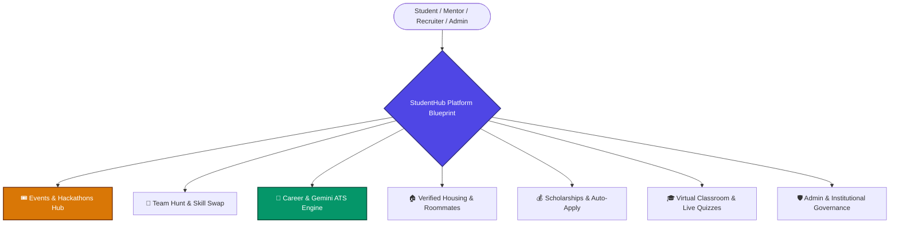

<div align="center">

# 🎓 StudentHub | Platform Blueprint
### The Enterprise Campus Innovation, Career & Collaborative Ecosystem

[](https://www.typescriptlang.org/)
[](https://react.dev/)
[](https://vitejs.dev/)
[](https://nodejs.org/)
[](https://expressjs.com/)
[](https://www.mongodb.com/)
[](https://socket.io/)
[](https://ai.google.dev/)
[](https://tailwindcss.com/)
[](https://www.docker.com/)
[](https://opensource.org/licenses/MIT)

<p align="center">
  <b>A production-grade, distributed web platform engineered to consolidate higher education lifecycles—unifying real-time hackathons, AI-powered placement preparation, peer team matching, verified campus housing, and interactive virtual classrooms.</b>
</p>

[Explore Documentation](./docs/README.md) • [Live Demo Preview](http://localhost:8080) • [Architecture](./docs/03-system-architecture.md) • [API Reference](./docs/05-api-documentation.md) • [Contributing](./docs/13-governance-and-credits.md)

</div>

---

## 🧭 Executive Summary & Problem Solved

Higher education students navigate fragmented tooling: discovering hackathons on disparate forms, searching for project teammates in chaotic chat groups, submitting un-optimized resumes into ATS black holes, and risking scams on unverified housing boards.

**StudentHub** eliminates this fragmentation by providing an integrated, event-driven web platform. Built with a high-performance **React 18 + TypeScript** client and a scalable **Node.js + MongoDB + Socket.io** backend, it delivers sub-50ms real-time synchronization, concurrency-safe resource reservations, and automated career acceleration powered by **Google Gemini 1.5 Pro**.



---

## 🏛️ System Architecture Snapshot

```mermaid
graph TB
    subgraph Client_Layer [Presentation Layer (React 18 + TypeScript + Vite)]
        Web[Desktop Web Application]
        Mobile[Mobile Optimized Sticky Layouts]
        State[TanStack Query + React Context Cache]
    end

    subgraph Transport_Layer [Ingress & Protocols]
        REST_HTTP[HTTPS / REST API Gateway]
        WSS_Sockets[WSS / Bi-Directional WebSockets]
    end

    subgraph Service_Layer [Application Logic & Engines (Node.js + Express)]
        Auth[JWT Stateless Auth & RBAC]
        Matchmaker[Team Matchmaking & Jaccard Overlap]
        Cron[Node-Cron Scheduled Ingestion & Expirations]
        SocketEngine[Socket.io Room Multiplexer]
    end

    subgraph AI_Intelligence_Layer [Generative Intelligence]
        Gemini[Google Gemini 1.5 Pro AI Service]
        ATS_Engine[Multi-Metric Resume Scoring Algorithm]
    end

    subgraph Persistence_Layer [Data & Storage Layer]
        MongoDB[(MongoDB Atlas - 260+ Mongoose Models)]
        GeoIndex[2dsphere Geospatial Queries]
        TTL_Index[TTL 15-Minute Slot Expiration Indexes]
    end

    Client_Layer -->|REST Endpoints| REST_HTTP
    Client_Layer <-->|Real-Time Rooms| WSS_Sockets
    
    REST_HTTP --> Service_Layer
    WSS_Sockets --> SocketEngine
    
    Service_Layer --> AI_Intelligence_Layer
    Service_Layer --> Persistence_Layer
    SocketEngine --> Persistence_Layer
```

---

## ⚡ Key Feature Highlights

| Pillar | Capabilities | Key Technical Implementations |
|:---|:---|:---|
| **1. Events & Hackathons** | 4-step creation wizard, real-time live preview, mobile sticky actions, calendar export (`.ics`). | Strict temporal validation, automatic draft state machines, admin moderation panel. |
| **2. Team Hunt & Skill Swap** | Algorithmic skill matching, missing skill learning paths, gamified peer streaks. | Jaccard set overlap scoring, in-memory curated roadmap suggestions, WebRTC coordination. |
| **3. Career & AI Placement** | Instant ATS resume scoring, voice/text mock interviews, aptitude & OA simulators. | Google Gemini 1.5 Pro integration with exponential backoff retries and structured schema validation. |
| **4. Housing & Marketplace** | Roommate lifestyle compatibility matching, verified rental contracts, repair slot holds. | Atomic MongoDB reservation operators with TTL index auto-expiration to prevent double-booking. |
| **5. Scholarships & Aid** | Automated discovery filter, 1-click batch applications, peer essay circles. | Multidimensional eligibility matrices (GPA, major, demographic criteria). |
| **6. Virtual Classroom** | Live buzzer quiz tournaments, collaborative real-time whiteboard, video rooms. | Sub-50ms Socket.io room broadcasting, canvas stroke streaming, automated session recap. |
| **7. Campus Community** | Alumni AMAs, Q&A boards, peer notes marketplace, automated tech news feed. | Markdown/LaTeX rendering, automated RSS ingest cron with deduplication heuristics. |
| **8. Admin Governance** | Multi-tenant institutional panels, audit logs, review fraud heuristic detectors. | Role-Based Access Control (`super_admin`, `institution_admin`), heuristic burst-velocity filters. |

---

## 🚀 3-Minute Quick Start Guide

### Prerequisites
- **Node.js**: `v20.x` or higher
- **MongoDB**: Local MongoDB or [MongoDB Atlas](https://www.mongodb.com/atlas) URI
- **Google Gemini API Key**: [Get API Key](https://aistudio.google.com/)

### Step-by-Step Installation

```bash
# 1. Clone the repository
git clone https://github.com/your-username/platform-blueprint.git
cd platform-blueprint

# 2. Install root and frontend dependencies
npm install

# 3. Install backend dependencies
cd backend
npm install
cd ..

# 4. Set up environment variables
cp backend/.env.example backend/.env
# Edit backend/.env with your MONGO_URI, JWT_SECRET, and GEMINI_API_KEY

# 5. Seed initial database collections
cd backend
node seedColleges.js
node seedEvents.js
node seedOA.js
cd ..

# 6. Start Frontend and Backend concurrently
npm run start:all
```

Open **`http://localhost:8080`** in your browser to access the live application.

---

## 🐳 Docker Multi-Container Execution

Spin up the entire distributed stack (Frontend, Express API, MongoDB) with a single command:

```bash
# Build and run containers in background
docker-compose up --build -d

# View live streaming logs
docker-compose logs -f
```

---

## 📚 Complete Documentation Suite (`/docs`)

For exhaustive architectural specifications, API schemas, and engineering guides, explore the dedicated `/docs` directory:

| # | Document | Direct Link | Key Focus Areas |
|:---:|:---|:---:|:---|
| **01** | **Project Overview & Objectives** | [`docs/01-project-overview.md`](./docs/01-project-overview.md) | Vision, Problem Statement, Business & Engineering OKRs |
| **02** | **Features & Requirements** | [`docs/02-features-and-requirements.md`](./docs/02-features-and-requirements.md) | 8 Core Pillars, FR-01 to FR-25, NFRs, User Stories & Use Cases |
| **03** | **System Architecture & Design** | [`docs/03-system-architecture.md`](./docs/03-system-architecture.md) | High-Level & Low-Level Design, WebSockets, Data Flow Diagrams |
| **04** | **Database Design & ERDs** | [`docs/04-database-design.md`](./docs/04-database-design.md) | 260+ Mongoose Models, ER Diagram, Indexing & TTL Strategies |
| **05** | **REST & WebSocket API Reference**| [`docs/05-api-documentation.md`](./docs/05-api-documentation.md) | REST Endpoints, Payloads, Status Codes & Socket.io Events |
| **06** | **Auth, RBAC & Security** | [`docs/06-auth-and-security.md`](./docs/06-auth-and-security.md) | JWT Lifecycle, Multi-Tier RBAC, OWASP Top 10 Defenses |
| **07** | **AI Pipeline & Algorithms** | [`docs/07-ai-ml-pipeline.md`](./docs/07-ai-ml-pipeline.md) | Gemini ATS Engine, Jaccard Team Matcher, Fraud Scanners |
| **08** | **Tech Stack & Repository Tree** | [`docs/08-tech-stack-and-structure.md`](./docs/08-tech-stack-and-structure.md) | Architectural Decision Records (ADRs) & Annotated File Tree |
| **09** | **Setup, Docker & Deployment** | [`docs/09-setup-and-installation.md`](./docs/09-setup-and-installation.md) | Local Installation, Docker Compose & Production Cloud Setup |
| **10** | **Testing & Performance** | [`docs/10-testing-and-performance.md`](./docs/10-testing-and-performance.md) | Vitest, Cypress E2E, Race Condition Harnesses & Benchmarks |
| **11** | **Operations & Troubleshooting**| [`docs/11-operations-and-troubleshooting.md`](./docs/11-operations-and-troubleshooting.md) | Limitations, Product Roadmap, Error Remedies & Developer FAQ |
| **12** | **Demo Tour & Media Showcase** | [`docs/12-demo-and-media.md`](./docs/12-demo-and-media.md) | Visual UI Walkthrough & 5-Minute Guided Recruiter Tour |
| **13** | **Governance & Credits** | [`docs/13-governance-and-credits.md`](./docs/13-governance-and-credits.md) | Contributing Guide, MIT License, References & Maintainers |

---

## 🛠️ Technology Stack & Justifications

| Layer | Technology | Version | Architectural Justification |
|:---|:---|:---|:---|
| **Frontend UI** | **React** | `18.3+` | Component-based reactive UI with Concurrent Mode and React Suspense. |
| **Language** | **TypeScript** | `5.8+` | End-to-end type safety, preventing runtime errors across 160+ page views. |
| **Bundler** | **Vite** | `5.4+` | Ultra-fast native ESM development server with sub-50ms HMR and Rollup builds. |
| **Styling** | **Tailwind CSS** | `3.4+` | Zero-runtime CSS purging producing minimal static bundles (< 30KB gzipped). |
| **Components** | **Shadcn UI / Radix** | Latest | Unstyled, accessible (WAI-ARIA compliant) headless primitives. |
| **Backend Runtime**| **Node.js** | `20.x LTS`| High-throughput non-blocking I/O event loop for asynchronous operations. |
| **API Framework** | **Express.js** | `4.x` | Lightweight, unopinionated routing layer with clean Controller-Service architecture. |
| **Database** | **MongoDB Atlas** | `7.0+` | Flexible polymorphic document model supporting 260+ domain schemas. |
| **ODM** | **Mongoose** | `8.x` | Strongly typed schema definitions, pre/post middleware hooks, and validation. |
| **Real-Time Engine**| **Socket.io** | `4.x` | Multiplexed WebSocket rooms for live quiz battles, chats, and whiteboard sync. |
| **Generative AI** | **Google Gemini** | `1.5 Pro`| Large context window, sub-3s inference speed for deep resume ATS evaluation. |
| **Testing** | **Vitest / Cypress** | Latest | Lightning-fast unit testing paired with browser-level E2E journey automation. |

---

## 🤝 Contributing & Community

We welcome contributions from open-source engineers, students, and educators!
Please read our [Contributing Guidelines](./docs/13-governance-and-credits.md) and [Code of Conduct](./docs/13-governance-and-credits.md#2-code-of-conduct) before opening pull requests.

```bash
# Branch Naming Standard
git checkout -b feat/your-feature-name
git checkout -b fix/your-bug-fix
```

---

## 📄 License

This repository is licensed under the **[MIT License](https://opensource.org/licenses/MIT)**. You are free to fork, adapt, and build upon this platform for educational and commercial purposes.

---

<div align="center">
  <b>Built with passion for students, builders, and future innovators worldwide.</b><br>
  <sub>StudentHub Platform Blueprint © 2026. All rights reserved.</sub>
</div>
