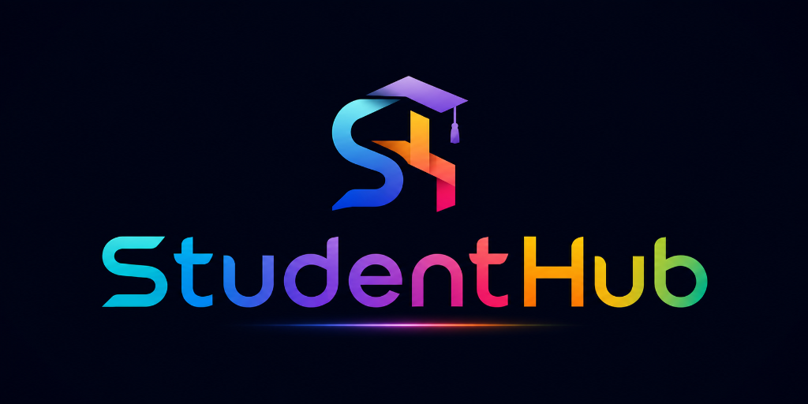

<div align="center">
  
  <h1>StudentHub</h1>
  <p><strong>The All-in-One Platform for Ambitious Students</strong></p>

  <p>
    <a href="https://reactjs.org/"></a>
    <a href="https://vitejs.dev/"></a>
    <a href="https://tailwindcss.com/"></a>
    <a href="https://nodejs.org/"></a>
    <a href="https://www.mongodb.com/"></a>
  </p>
</div>

<hr />

## 📖 Overview

**StudentHub** is a comprehensive, full-stack ecosystem designed to empower students throughout their academic and professional journeys. From discovering local events and managing collaborative study notes, to connecting with alumni and identifying ideal roommates, StudentHub unifies fragmented university experiences into a single, high-performance platform.

Built with a modern, scalable architecture, StudentHub is designed to handle high-throughput interactions while maintaining a buttery-smooth user experience.

## ✨ Key Features

*   📚 **Notes Hub & Learning Resources:** Upload, share, and consume academic materials. Features a robust viewer and AI-powered metadata tagging. (Note: Direct downloads are disabled to promote collaborative online reading).
*   🎯 **Events & Hackathons:** Discover, RSVP, and track local and global tech events. Features dynamic API integrations (e.g., DEV.to) for outer-space data sync.
*   🤝 **Collaboration & Networking:** Form study groups, engage in the Community Forum, and connect with verified alumni.
*   🏠 **Local Services & Roommate Finder:** Find verified accommodations and connect with compatible roommates using advanced filtering algorithms.
*   💼 **Career Readiness:** Access the Resume Builder, Jobs Portal, Placement Cell, and AI Mentor to prepare for the industry.
*   🔐 **Enterprise-Grade Auth:** Secure JWT-based authentication layered with Passport.js for seamless OAuth integration (Google/GitHub).

## 🏗️ Architecture

StudentHub embraces a decoupled microservice-ready architecture.

*   **Frontend (Client):** 
    *   **Framework:** React 18 + TypeScript, bootstrapped via Vite for HMR and optimized builds.
    *   **Styling:** Tailwind CSS + Radix UI (via `shadcn/ui`) for highly accessible, customizable, and lightweight components.
    *   **State & Routing:** React Router DOM, customized React hooks for auth and data fetching.
*   **Backend (API):**
    *   **Runtime:** Node.js + Express.js.
    *   **Database:** MongoDB via Mongoose ODM for flexible schema design and fast querying.
    *   **Security:** Helmet, CORS, standard rate limiting, and Passport-based OAuth.

## 🚀 Getting Started

### Prerequisites

*   **Node.js** (v18 or higher)
*   **MongoDB** (Local instance or Atlas URI)
*   **Git**

### Installation

1.  **Clone the repository:**
    ```bash
    git clone https://github.com/sandeep-kumar-270904/platform-blueprint.git
    cd platform-blueprint
    ```

2.  **Install Frontend Dependencies:**
    ```bash
    npm install
    ```

3.  **Install Backend Dependencies:**
    ```bash
    cd backend
    npm install
    ```

### Environment Configuration

Create a `.env` file in both the root directory and the `/backend` directory. 

**`/backend/.env` Example:**
```env
PORT=5000
MONGODB_URI=mongodb://localhost:27017/studenthub
JWT_SECRET=your_super_secret_jwt_key
GOOGLE_CLIENT_ID=your_google_oauth_client_id
GOOGLE_CLIENT_SECRET=your_google_oauth_secret
```

**`/.env` (Frontend) Example:**
```env
VITE_API_URL=http://localhost:5000
```

### Running the Application (Development)

StudentHub comes with a unified start script using `concurrently`. From the **root** directory, simply run:

```bash
npm run start:all
```

*   **Frontend:** http://localhost:8080
*   **Backend:** http://localhost:5000

## 📂 Project Structure

```text
platform-blueprint/
├── backend/                  # Node.js/Express API Server
│   ├── config/               # DB and Auth configurations
│   ├── controllers/          # Request handlers & business logic
│   ├── models/               # Mongoose schemas
│   ├── routes/               # API route definitions
│   └── services/             # External API integrations & background jobs
├── src/                      # React Frontend Application
│   ├── components/           # Reusable UI components (shadcn/ui)
│   ├── hooks/                # Custom React hooks (useAuth, etc.)
│   ├── pages/                # Route-level components (NotesHub, Events, etc.)
│   ├── lib/                  # Utility functions
│   └── main.tsx              # Application entry point
├── public/                   # Static assets (logos, placeholders)
└── package.json              # Workspace configuration
```

## 🛠️ Testing & Production Build

To verify the integrity of the application and preview the production-optimized build:

1.  **Build the Frontend:**
    ```bash
    npm run build
    ```
2.  **Preview the Build Locally:**
    ```bash
    npm run preview
    ```

## 🛡️ License

This project is proprietary. All rights reserved. 

---
<div align="center">
  <i>Engineered with excellence for the next generation of builders.</i>
</div>
