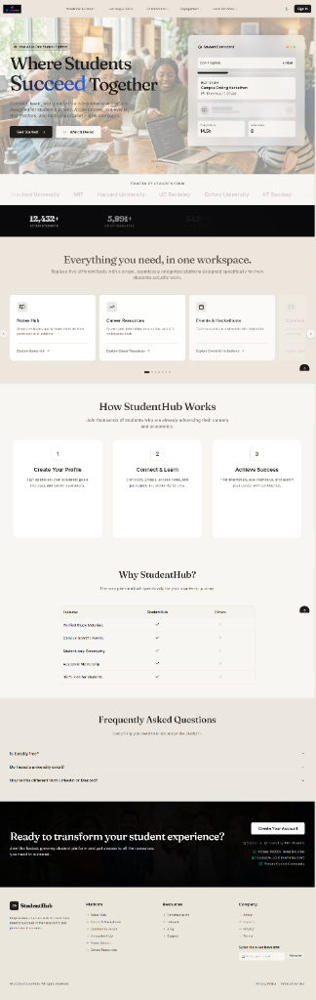
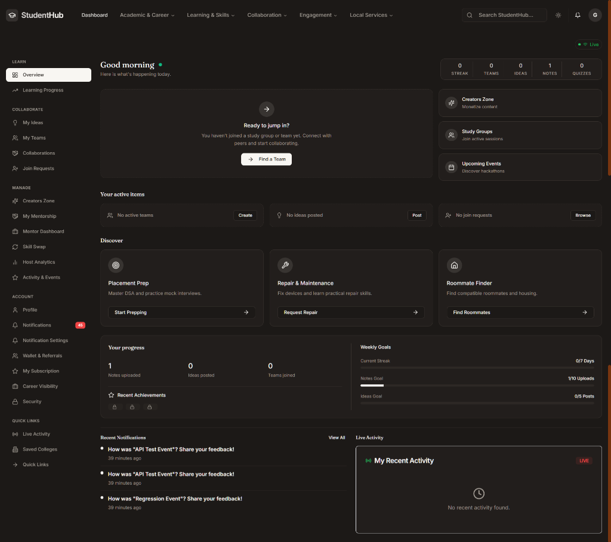
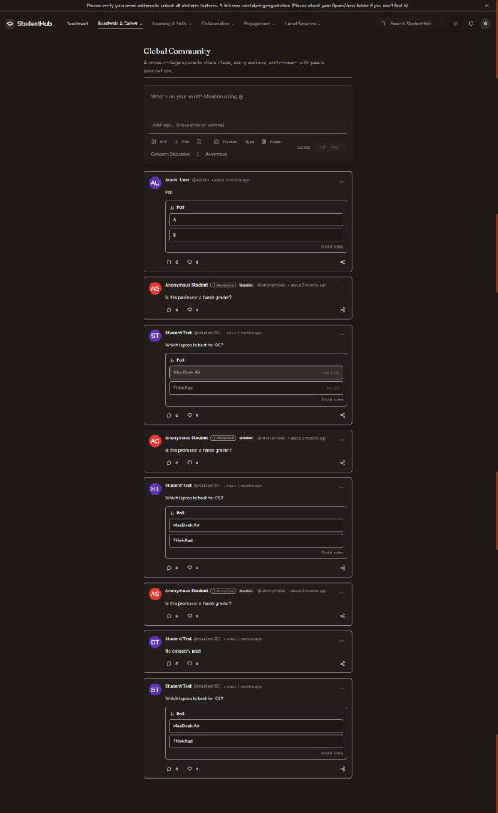
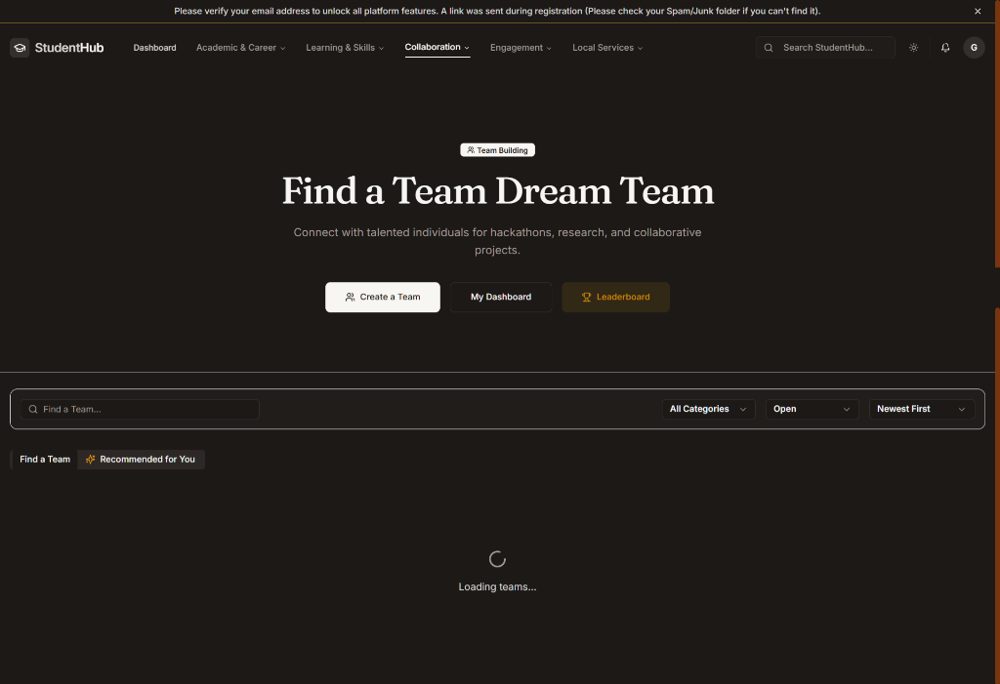
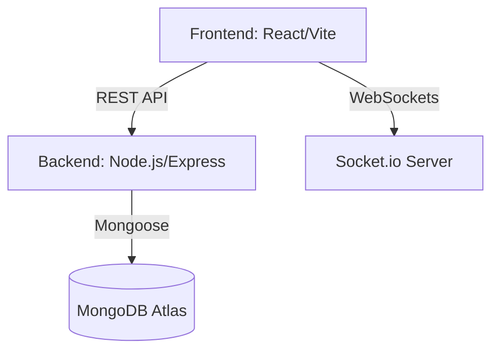

<div align="center">

# StudentHub
### Full-Stack Campus & Career Platform

[](https://www.typescriptlang.org/)
[](https://react.dev/)
[](https://vitejs.dev/)
[](https://nodejs.org/)
[](https://expressjs.com/)
[](https://www.mongodb.com/)
[](https://socket.io/)
[](https://ai.google.dev/)
[](https://tailwindcss.com/)
[](https://www.docker.com/)
[](https://opensource.org/licenses/MIT)

[Live Demo](https://platform-blueprint.vercel.app/) | [GitHub](https://github.com/sandeep-kumar-270904/platform-blueprint)

</div>

StudentHub is a full-stack web application designed to bring student events, hackathons, team discovery, career preparation, learning tools, and campus services into one platform.

## Screenshots

<div align="center">
  
  
  
  
</div>

## Problem

Modern university students face extreme fragmentation across their academic, professional, and residential milestones. 
- **Platform Fatigue**: Juggling separate systems for hackathons, housing, academics, and career prep.
- **Missed Opportunities**: Students lack visibility into verified campus events, study groups, and cross-disciplinary project teams.
- **Career Blindspots**: Students often submit poorly formatted resumes and lack realistic technical interview practice before actual placement drives.

## Solution

StudentHub centralizes the fragmented college experience by providing a single, unified ecosystem for academics, career growth, and campus life. Instead of juggling a dozen different apps, students can find hackathon teams, practice for interviews with AI, secure verified off-campus housing, and attend interactive virtual classrooms all in one place. It bridges the gap between campus resources and successful career placements.

## Key Features

- JWT authentication and role-based access control
- RESTful APIs with Node.js and Express
- MongoDB persistence with domain-specific models and indexes
- Real-time workflows using Socket.io
- Gemini-powered AI features for career preparation
- Concurrency-safe reservation workflows
- Responsive React + TypeScript frontend
- Automated testing and deployment workflows

## Architecture


```mermaid
graph TD;
    Client[Frontend: React/Vite] -->|REST API| Server[Backend: Node.js/Express];
    Client -->|WebSockets| Realtime[Socket.io Server];
    Server -->|Mongoose| DB[(MongoDB Atlas)];
```

## Tech Stack

**Frontend:** React, TypeScript, Vite, Tailwind CSS, Shadcn UI  
**Backend:** Node.js, Express.js  
**Database:** MongoDB Atlas, Mongoose  
**Realtime:** Socket.io  
**AI Engine:** Google Gemini  
**Testing:** Vitest, Cypress, Jest  
**Deployment:** Vercel / Render

## Engineering Decisions

- **Monorepo Architecture**: Kept frontend and backend tightly coupled in a single repository for rapid iteration and unified deployment configuration.
- **Concurrent Reservations**: Employed MongoDB atomic operators (`$set`, `$inc`) to prevent race conditions during heavy event-booking or slot-reservation windows.
- **Real-Time WebSockets**: Selected Socket.io over long-polling to achieve low-latency buzzer systems and live whiteboard syncing in Virtual Classrooms.
- **AI Integration**: Chose Google Gemini Pro for its massive context window and structured JSON output mode, drastically simplifying ATS scoring pipelines.

## Setup

```bash
# Clone the repository
git clone https://github.com/sandeep-kumar-270904/platform-blueprint.git
cd platform-blueprint

# Install dependencies
npm install
cd backend && npm install && cd ..

# Start application (Frontend on :8080, Backend on :5000)
npm run start:all
```

## Environment Variables

Create a `.env` file in the `backend/` directory:

```env
PORT=5000
MONGO_URI=mongodb+srv://<username>:<password>@cluster.mongodb.net/platform
JWT_SECRET=your_jwt_secret_key
GEMINI_API_KEY=your_google_gemini_key
```

## Testing

We utilize a comprehensive automated testing suite:
- **Backend**: Jest & Supertest for REST API endpoint validation and integration testing.
- **Frontend**: Vitest & React Testing Library for component-level rendering assertions.
- **CI/CD**: GitHub Actions pipeline automatically triggers on push to run linting, unit tests, and production builds.

To run tests locally:
```bash
# Run Frontend Tests
npm run test

# Run Backend Tests
cd backend && npm test
```

## Deployment

- **Frontend**: Automatically deployed via Vercel on `main` branch push.
- **Backend**: Deployed on Render with native Docker support.
- **Database**: Hosted on MongoDB Atlas with IP whitelisting configured for the production backend environment.

## Security

Security measures include Helmet, rate limiting, input validation, authentication controls, and secure configuration practices.
- **NoSQL Injection**: `express-mongo-sanitize` strips `$` and `.` operators from client payloads.
- **XSS Protection**: Automatic React JSX escaping combined with markdown sanitization.
- **Rate Limiting**: `express-rate-limit` caps auth and AI generation endpoints to prevent abuse.

## Limitations

- **In-Memory Node-Cron**: Background jobs run inside the main Node process; horizontal scaling requires migrating to BullMQ + Redis.
- **Stateful Socket.io**: Real-time servers currently rely on single-instance memory. Clustering multiple Node.js instances requires adding a Redis adapter.

## Future Work

- **Mobile Application**: Porting the React frontend to React Native for iOS/Android native clients.
- **Advanced Matchmaking**: Implementing a collaborative filtering recommendation engine for the Team Hunt feature.
- **Payment Gateway**: Integrating Stripe for premium event ticketing and verified housing deposits.

## My Role

**Full-Stack Developer**

Designed and implemented the frontend, backend APIs, authentication, database models, AI integrations, realtime workflows, and deployment configuration.
