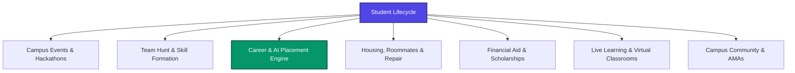
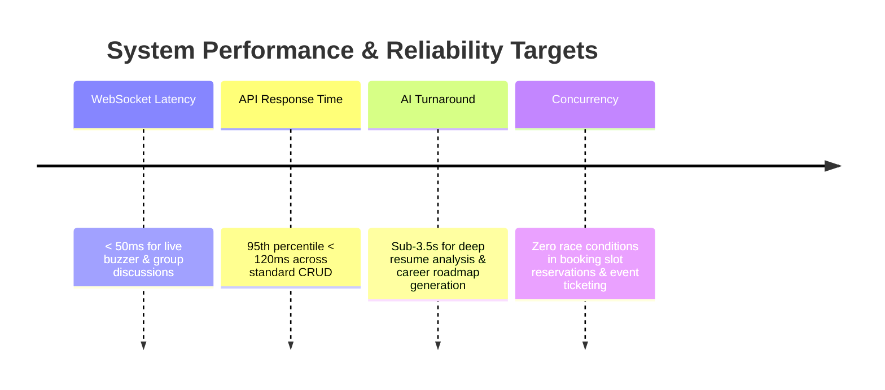
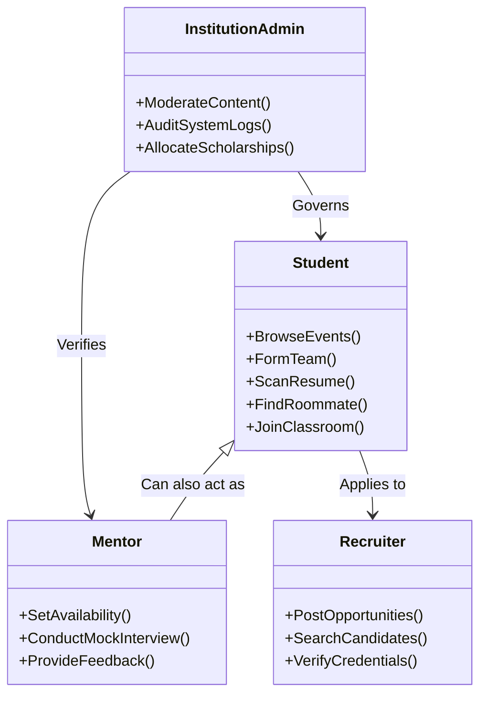

# 01. Project Overview, Problem Statement & Objectives

---

## 1. Executive Project Overview

**StudentHub (Platform Blueprint)** is an enterprise-grade, full-stack campus innovation, career preparation, and collaborative ecosystem. Designed to consolidate the fragmented lifecycle of higher education students, the platform unifies real-time event management, peer team formation (Team Hunt), AI-powered career accelerators (ATS resume scoring, mock interviews, placement preparation), verified student accommodation and roommate matching, scholarship automation, interactive live virtual classrooms, and a student-driven marketplace into a single cohesive, high-performance web application.

The platform is engineered as a modern, reactive distributed system with a **React 18 + TypeScript + Tailwind CSS** frontend and an event-driven **Node.js + Express + MongoDB + Socket.io** backend, integrated with **Google Gemini Pro** for real-time generative intelligence and automated mentorship.

---

## 2. Problem Statement

Modern university and college students face intense fragmentation across their academic, extracurricular, and career milestones. Current student tooling suffers from four critical pathologies:

### 1. The Disconnected Tooling Matrix
Students manage hackathons via external forms (Google Forms, Devpost), team formation through unindexed WhatsApp/Discord groups, career preparation on generic commercial job boards, and off-campus housing through untrusted Craigslist/Facebook posts. This leads to information loss, communication overhead, and missed deadlines.

### 2. The Feedback Void in Career Preparation
Traditional career boards operate as asynchronous black holes. Students submit un-optimized resumes without understanding why they fail Applicant Tracking Systems (ATS) screenings, lack objective metrics for mock interview readiness, and have no visibility into the specific skill gaps blocking them from high-demand campus placement roles.

### 3. Asymmetric Information in Campus Housing & Financial Aid
Finding roommates and off-campus rentals is plagued by unverified listings, safety hazards, and lack of lifestyle compatibility verification. Similarly, millions of dollars in institutional and external scholarships go unclaimed annually because students lack automated discovery, eligibility matching, and batch application workflows.

### 4. Absence of Structured Peer Collaboration
While students want to build hackathon projects, study for competitive coding assessments, and conduct peer group discussions (GDs), they lack an algorithmic matching platform that pairs them with peers based on complementary skills, schedules, and verified commitment levels.

---

## 3. Business & Engineering Objectives

To solve these systemic challenges, StudentHub establishes the following strategic and technical objectives:

### Strategic Objectives

| Pillar | Strategic Objective | Metric / Target |
|:---|:---|:---|
| **Consolidation** | Unify 8 major student workflows into a single authenticated portal. | 100% single sign-on (SSO) and shared user identity across all modules. |
| **Career Velocity** | Accelerate student placement readiness through instantaneous AI feedback. | Provide < 3-second ATS scoring and actionable skill gap recommendations. |
| **Trust & Safety** | Eliminate scams and bad actors across housing and campus commerce. | 100% verified student badge enforcement and automated fraud pattern detection. |
| **Collaborative Growth** | Foster cross-disciplinary team formation for hackathons and startups. | Achieve > 85% algorithmic compatibility in peer matchmaking. |

### Engineering Objectives (OKRs)

1. **Sub-50ms Real-Time Synchronization**: Enable zero-latency live quizzes, classroom whiteboard updates, and instant collaboration requests via Socket.io WebSocket rooms.
2. **Deterministic Data Integrity**: Implement atomic MongoDB transactions and optimistic locking to prevent double-booking of mentor sessions, repair slots, and event tickets under high concurrency.
3. **Enterprise Modularity**: Decouple business domains into clean controller-service layers, backed by 260+ Mongoose models, supporting multi-tenant institutional administration.
4. **Resilient AI Pipelines**: Integrate Google Gemini Pro with exponential backoff retries, local token rate-limiting, and schema validation to guarantee 99.9% uptime for AI career features.

---

## 4. Target Personas & Stakeholders

1. **Undergraduate & Graduate Students**: Seekers of hackathon teammates, career guidance, affordable housing, scholarships, and academic peer support.
2. **Alumni Mentors & Industry Coaches**: Experienced professionals offering 1-on-1 mock interviews, resume critiques, and referral relays.
3. **Campus Recruiters & Talent Acquisition Teams**: Verified corporate partners looking to discover vetted student talent, post campus drives, and conduct technical assessments.
4. **Institution & Department Administrators**: University deans and placement cell heads overseeing campus-wide announcements, scholarship disbursements, and platform safety moderation.
