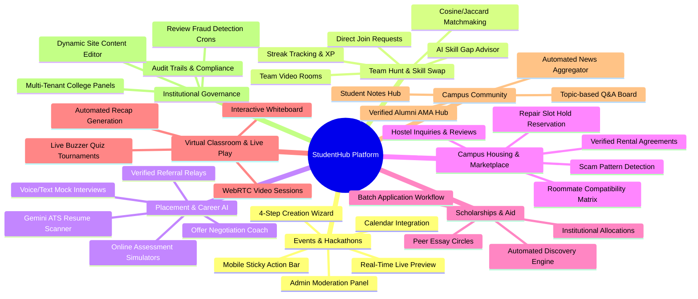
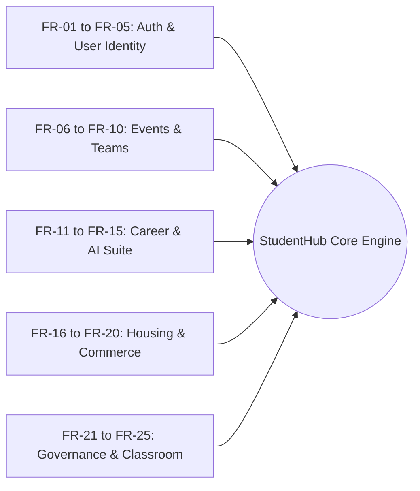
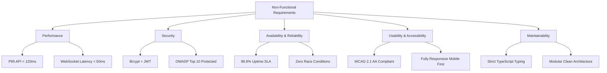
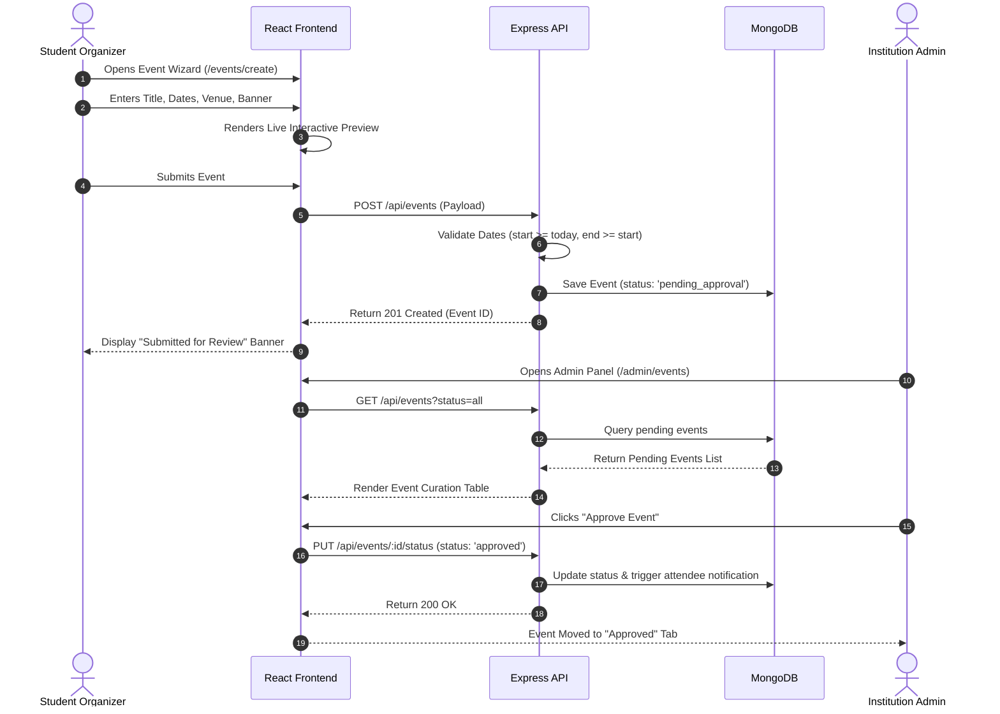
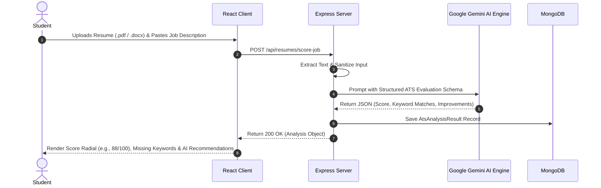

# 02. Features, Requirements, User Stories & Use Cases

---

## 1. Core Feature Matrix

StudentHub is structured around **8 comprehensive core pillars**, each designed to address specific requirements in the student lifecycle:

### Pillar Breakdown

| Pillar | Sub-Modules | Primary Technical Capabilities |
|:---|:---|:---|
| **1. Events & Hackathons** | Discovery, Creation Wizard, Event Detail, Admin Curation | 4-step responsive wizard, real-time live preview render, automated status transition (`draft` → `pending` → `approved`), calendar export (`.ics`, Google Calendar), waitlist handling. |
| **2. Team Hunt & Skill Swap** | Team Discovery, Application Manager, Skill Gap Advisor, Skill Swaps | Algorithmic skill matching, AI-generated learning paths for missing skills, gamified peer streaks, WebRTC peer session coordination. |
| **3. Placement & Career AI** | ATS Resume Hub, Mock Interviews, Aptitude Simulator, OA Engine | Google Gemini 1.5 multi-metric ATS analysis, real-time audio/text conversational AI interview practice, question bank with automated difficulty calibration. |
| **4. Housing & Student Services** | Roommate Finder, Rental Agreements, Repair Marketplace | Multi-criteria lifestyle matching score, atomic slot hold reservations with TTL expiration workers, geospatial `2dsphere` query for local repair shops. |
| **5. Scholarships & Aid** | Discovery Portal, Batch Apply, Scholarship Circles, Essay Bank | Eligibility filtering by GPA/major/ethnicity, AI essay refinement, peer review circles, institutional fund allocation management. |
| **6. Virtual Classroom** | Live Sessions, Quiz Tournaments, Collaborative Whiteboard | Socket.io low-latency synchronized buzzer battles, real-time canvas drawing synchronization, session attendance logging. |
| **7. Campus Community** | AMA Hub, Q&A Forums, Notes Marketplace, Tech News | Threaded discussions with Markdown and LaTeX, upvoting/downvoting, automated RSS tech news ingest cron with deduplication. |
| **8. Admin & Governance** | Moderation Dashboard, Audit Logs, Fraud Scanners, Site CMS | Role-based administrative dashboard (`super_admin`, `institution_admin`), heuristic review manipulation detector, full audit logging. |

---

## 2. Functional Requirements (FR)

### Authentication & User Identity
- **FR-01**: The system must provide secure registration and login using JWT (JSON Web Tokens) with email verification and bcrypt password hashing (minimum 10 salt rounds).
- **FR-02**: The system must enforce multi-role authorization (`student`, `mentor`, `recruiter`, `institution_admin`, `super_admin`).
- **FR-03**: The system must allow users to maintain comprehensive profiles including technical skills, verified education, Github/LinkedIn links, and roommate lifestyle preferences.
- **FR-04**: The system must support student institutional verification via `.edu` email domains or administrative approval.
- **FR-05**: The system must allow granular notification preferences for email, push notifications, and in-app alerts.

### Events & Team Formation
- **FR-06**: The system must provide a 4-step event creation wizard with live card preview and draft saving.
- **FR-07**: The system must restrict event publishing to administrative approval workflows (`status: pending_approval` → `approved`).
- **FR-08**: The system must calculate a percentage compatibility match score between a user's skills and a team's required roles.
- **FR-09**: The system must provide automated skill gap advice and curated external learning resources for missing team skills.
- **FR-10**: The system must support real-time team application tracking (apply, accept, reject, withdraw) with WebSocket notifications.

### Career Preparation & AI Intelligence
- **FR-11**: The system must parse uploaded resumes (PDF/DOCX/JSON) and analyze them against target job descriptions using Google Gemini Pro.
- **FR-12**: The system must generate an ATS score (0-100), identify missing keywords, evaluate bullet point impact, and suggest actionable revisions.
- **FR-13**: The system must conduct AI-driven mock interviews with dynamic follow-up questions and post-interview readiness metrics.
- **FR-14**: The system must provide time-bounded Online Assessment (OA) simulators with automated scoring.
- **FR-15**: The system must calibrate quiz problem difficulty ratings dynamically based on user attempt pass rates.

### Housing, Marketplace & Financial Aid
- **FR-16**: The system must match potential roommates based on lifestyle parameters (cleanliness, sleep schedule, noise tolerance).
- **FR-17**: The system must prevent double-booking of repair provider slots using atomic slot holds with automatic 15-minute expiration workers.
- **FR-18**: The system must filter scholarships by GPA, field of study, financial need, and demographic eligibility criteria.
- **FR-19**: The system must allow single-click batch applications to multiple pre-matched scholarships.
- **FR-20**: The system must flag suspected fraudulent reviews and scam listings using automated heuristic rule sets.

### Live Learning, Community & Governance
- **FR-21**: The system must synchronize live buzzer quiz tournaments across multiple concurrent participants with sub-100ms precision.
- **FR-22**: The system must provide collaborative markdown note sharing with rating and comment capabilities.
- **FR-23**: The system must run hourly automated cron jobs to ingest, deduplicate, and publish campus tech news.
- **FR-24**: The system must provide an administrative panel for moderating user reports, disputed transactions, and submitted events.
- **FR-25**: The system must record immutable audit logs for all administrative actions and security-sensitive events.

---

## 3. Non-Functional Requirements (NFR)

### Performance & Scalability
- **NFR-01 (API Latency)**: 95% of standard REST API requests must respond in under 120ms under a load of 1,000 concurrent active users.
- **NFR-02 (WebSocket Latency)**: Real-time event broadcasts (quiz buzzers, chat messages, whiteboard updates) must reach clients in under 50ms.
- **NFR-03 (AI Turnaround)**: Resume scoring and AI advice generation must complete within 3.5 seconds.
- **NFR-04 (Database Scalability)**: Queries on core collections (Events, Users, Teams, Applications) must use compound and geospatial indexes to maintain index scan execution times under 15ms.

### Security & Compliance
- **NFR-05 (Data Protection)**: All sensitive communications must be encrypted in transit via TLS 1.3 and at rest using AES-256 storage encryption.
- **NFR-06 (Injection Protection)**: All API inputs must be sanitized against NoSQL injection (`mongo-sanitize`) and XSS attacks (`DOMPurify` / React JSX escaping).
- **NFR-07 (Rate Limiting)**: Public endpoints (login, register, AI generation) must enforce rate limits (e.g., max 10 AI calls per minute per user) to protect from DDoS and API exhaustion.

### Usability & Accessibility
- **NFR-08 (Mobile First)**: The UI must be fully responsive across mobile (320px+), tablet, and desktop viewports, featuring mobile-specific components like sticky action bars.
- **NFR-09 (Accessibility)**: The frontend must comply with WCAG 2.1 Level AA standards, ensuring keyboard navigability, high contrast text ratios, and ARIA labels.
- **NFR-10 (Reliability)**: The platform must achieve 99.9% uptime with automated error boundary containment in the React client tree to prevent white-screen crashes.

---

## 4. User Stories

### Persona 1: Alex (Computer Science Undergraduate)
- **US-01 (Hackathon Team Search)**: *As a 3rd-year CS student*, I want to filter open hackathon teams by required skills (e.g., Python, React), so that I can join a competitive team that complements my frontend expertise.
- **US-02 (ATS Resume Optimization)**: *As an aspiring software intern*, I want to scan my resume against real tech job descriptions, so that I can see my ATS score and fix missing keywords before applying.
- **US-03 (Roommate Matching)**: *As an off-campus renter*, I want to view compatibility scores with potential roommates based on sleep schedules and cleanliness, so that I can find a peaceful living environment.

### Persona 2: Sarah (Senior Alumna & Tech Mentor)
- **US-04 (Mock Interview Scheduling)**: *As an engineering alumna*, I want to set my weekly availability slots for 1-on-1 mock interviews, so that students can book sessions without endless back-and-forth emails.
- **US-05 (Structured Evaluation)**: *As an interviewer*, I want to submit structured evaluation rubrics with strengths and improvement areas, so that mentees receive actionable guidance.

### Persona 3: David (Campus Recruiter)
- **US-06 (Vetted Candidate Search)**: *As a tech recruiter*, I want to search student profiles by verified skills, contest rankings, and project portfolios, so that I can source top candidates for our campus hiring drive.
- **US-07 (Challenge Hosting)**: *As a corporate sponsor*, I want to host branded coding challenges and hackathons, so that our brand engages directly with top engineering talent.

### Persona 4: Dr. Martinez (Institution Administrator)
- **US-08 (Event Moderation)**: *As a university dean*, I want to review and approve student-submitted campus events before they appear publicly, so that campus safety and guidelines are maintained.
- **US-09 (Audit Inspection)**: *As an administrator*, I want to inspect audit logs for flagged content and disputed marketplace transactions, so that I can resolve campus disputes transparently.

---

## 5. Formal Use Cases

### Use Case UC-01: End-to-End Event Creation & Approval Flow

| Field | Description |
|:---|:---|
| **Use Case ID** | **UC-01** |
| **Title** | Create and Moderate Campus Event |
| **Primary Actor** | Student Club Organizer, Institution Administrator |
| **Preconditions** | Organizer is authenticated with an active student account. |
| **Postconditions** | Event is published to the public Discovery feed and calendar export is enabled. |
| **Main Flow** | 1. Organizer navigates to `/events/create`. 2. Wizard step 1: Fills basic details (Title, Type, Description). 3. Wizard step 2: Sets start/end dates, times, and location/virtual link. 4. Wizard step 3: Uploads banner image and sets registration limits. 5. Wizard step 4: Reviews live card preview and clicks "Publish". 6. Server validates temporal constraints and saves with `pending_approval`. 7. Admin accesses `/admin` and transitions status to `approved`. |
| **Alternative Flow** | *Start Date in Past*: Backend rejects with `400 Bad Request`. Wizard displays inline field error on Step 2. *Admin Rejection*: Admin provides rejection reason; status updates to `rejected` and organizer is notified via email/in-app alert. |

---

### Use Case UC-02: AI-Powered Resume ATS Optimization

| Field | Description |
|:---|:---|
| **Use Case ID** | **UC-02** |
| **Title** | Scan Resume Against Job Description via Gemini Pro |
| **Primary Actor** | Student Applicant |
| **Preconditions** | Student is authenticated and has a valid resume on file. |
| **Postconditions** | Analysis is permanently stored in history and career progress analytics update. |
| **Main Flow** | 1. Student opens Resume Dashboard and selects a target job role or pastes custom job description. 2. Student submits for ATS scoring. 3. Backend constructs structured prompt enforcing JSON output schema. 4. Gemini AI computes keyword overlap, tone analysis, bullet point quantify factor, and formatting health. 5. Backend validates AI JSON response, persists `AtsAnalysisResult`, and returns payload. 6. Frontend renders radial score gauge, bullet point recommendations, and single-click copy suggestions. |
