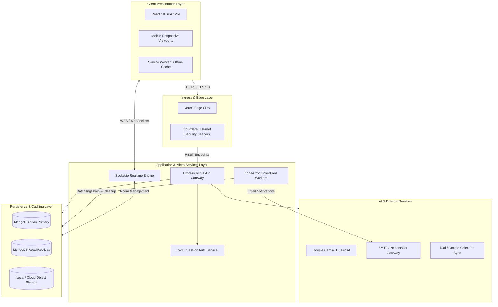
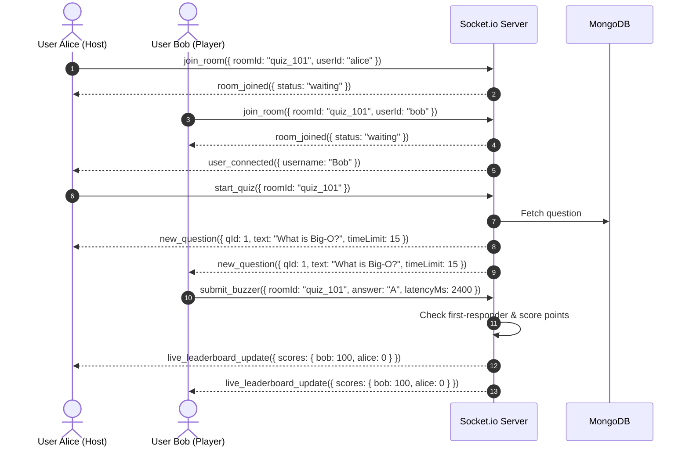
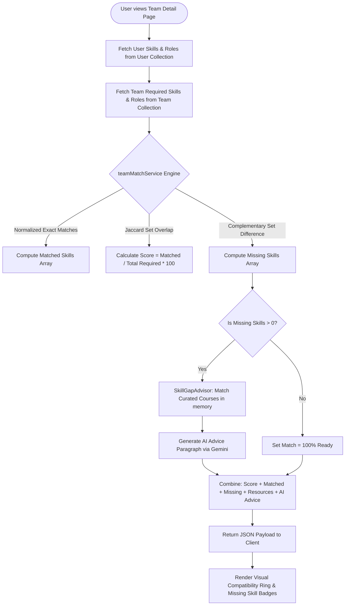
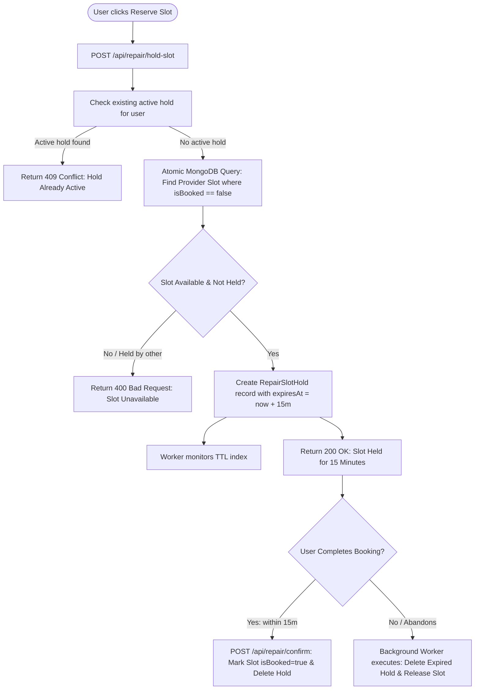

# 03. System Architecture & Design

---

## 1. High-Level Design (HLD)

StudentHub is structured as a **modern multi-tier, event-driven web application**. The system separates client-side presentation, API gateway and business services, asynchronous background workers, generative AI engines, and persistent database layers.



### Architectural Highlights
1. **Separation of Concerns**: Presentation (React SPA), Business Logic (Express Services), and Persistence (MongoDB Mongoose) are strictly decoupled.
2. **Bi-directional WebSocket Rooms**: Socket.io provides isolated rooms for live quizzes, group discussions, classroom collaboration, and real-time team chats.
3. **Resilient Background Processing**: Node-cron schedules automated jobs for news ingestion, 30-day notification cleanup, slot reservation expiration, and review fraud detection.

---

## 2. Low-Level Design (LLD) & Service Layering

The backend codebase adheres to the **Controller-Service-Repository pattern**, ensuring testability, maintainability, and clean dependency management:

```mermaid
graph LR
    subgraph Route_Layer [1. Routing Layer]
        R[express.Router]
    end
    
    subgraph Middleware_Layer [2. Middleware Pipeline]
        M1[authMiddleware]
        M2[rateLimiter]
        M3[mongoSanitize]
        M4[roleGuard]
    end
    
    subgraph Controller_Layer [3. Controller Layer]
        C[Domain Controllers e.g., eventController.js]
    end
    
    subgraph Service_Layer [4. Business Logic Services]
        S1[teamMatchService.js]
        S2[geminiService.js]
        S3[notificationService.js]
    end
    
    subgraph Model_Layer [5. Data Access Layer]
        M[Mongoose Models & Schemas]
    end
    
    R --> Middleware_Layer
    Middleware_Layer --> Controller_Layer
    Controller_Layer --> Service_Layer
    Service_Layer --> Model_Layer
```



### Backend Request Lifecycle

```
HTTP Request 
   │
   ▼
1. Express Global Middlewares (CORS, Helmet, Rate Limiter, JSON Parser)
   │
   ▼
2. Route Dispatcher (/api/events, /api/teams, /api/resumes)
   │
   ▼
3. Route-Level Guards (authMiddleware, requireAdmin, checkOwnership)
   │
   ▼
4. Controller Action (extracts req.body, req.user, validates params)
   │
   ▼
5. Domain Service Invocation (calculates scores, interacts with AI / DB)
   │
   ▼
6. Mongoose Document Persistence (atomic updates, validation hooks)
   │
   ▼
7. Formatted JSON Response (standardized envelope: { success, data, error })
```

---

## 3. Real-Time WebSocket Architecture

The platform uses **Socket.io** to manage state synchronization across multiple simultaneous user sessions:



### Socket Namespace & Room Topology
- `quiz-room-${quizId}`: Ephemeral rooms for live tournament battles, countdown timers, and buzzer events.
- `classroom-${classId}`: Whiteboard drawing strokes (`draw_stroke`, `clear_canvas`), hand-raising, and chat.
- `team-${teamId}`: Team Hunt collaboration workspace, real-time message stream, and call coordination.
- `user-${userId}`: Dedicated individual room for personal notifications (e.g., application accepted, slot reserved).

---

## 4. End-to-End Data Flow Diagrams

### Data Flow 1: Team Matchmaking & Compatibility Scoring



### Data Flow 2: Concurrency-Safe Repair Slot Reservation Flow


