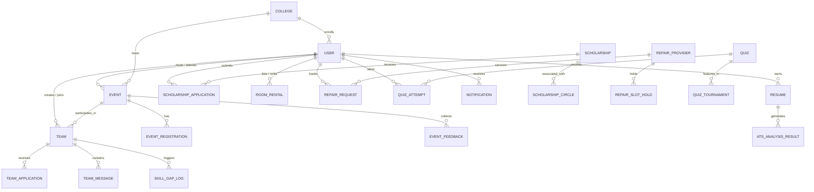
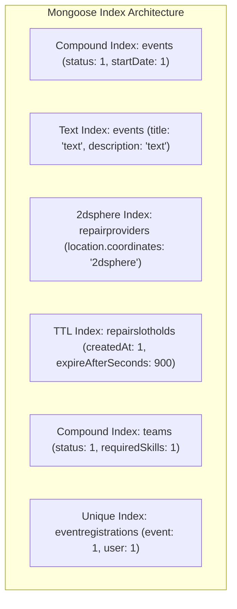

# 04. Database Design & Data Modeling

---

## 1. Database Architectural Decisions

StudentHub utilizes **MongoDB** via the **Mongoose ODM** as its primary persistence layer. This document-oriented architecture was selected over traditional relational databases for the following structural reasons:

1. **Polymorphic Data Models**: Higher education workflows exhibit dynamic attributes (e.g., Hackathon events require team size constraints, whereas Seminars require speaker biographies; Scholarships require flexible eligibility criteria matrices).
2. **High-Performance Nested Structures**: Complex documents like `Event` (with embedded `agenda`, `prizes`, `faqs`), `Resume` (with embedded `skills`, `education`, `workExperience`), and `VirtualClassroom` (with embedded `whiteboardStrokes`, `activeParticipants`) are retrieved in a single indexed read without costly multi-table joins.
3. **Geospatial Queries**: MongoDB's native `2dsphere` indexes allow instant bounding-box queries for local campus housing, hostels, and student repair providers.
4. **Flexible Evolution**: Rapid feature iteration without rigid schema migration downtime.

---

## 2. Core Entity-Relationship (ER) Diagram



---

## 3. Key Collection Schemas & Data Dictionary

### Collection: `users` (`User.js`)
Represents students, mentors, recruiters, and administrators across the platform.

| Field | Type | Required | Index | Description |
|:---|:---|:---|:---|:---|
| `_id` | ObjectId | Yes | Primary | Unique User Identifier |
| `name` | String | Yes | Text | Full display name |
| `email` | String | Yes | Unique | Primary institutional or personal email |
| `password` | String | Yes | No | Salted bcrypt password hash |
| `role` | String | Yes | Standard | `['student', 'mentor', 'recruiter', 'institution_admin', 'super_admin']` |
| `isVerified` | Boolean | No | Standard | Email/Identity verification flag |
| `skills` | Array | No | Multikey | List of verified technical/soft skills |
| `college` | ObjectId | No | Foreign | Reference to `College` collection |
| `lifestylePreferences` | Object | No | No | Cleanliness, sleep schedule, noise tolerance for roommates |
| `createdAt` | Date | Yes | Standard | Auto-generated timestamp |

---

### Collection: `events` (`Event.js`)
Stores all campus events, hackathons, workshops, and seminars.

| Field | Type | Required | Index | Description |
|:---|:---|:---|:---|:---|
| `_id` | ObjectId | Yes | Primary | Unique Event ID |
| `title` | String | Yes | Text | Event Title |
| `description` | String | Yes | Text | Full markdown description |
| `eventType` | String | Yes | Standard | `['hackathon', 'workshop', 'seminar', 'conference', 'tech_event', 'webinar', 'coding_contest', 'other']` |
| `bannerImage` | String | No | No | URL to banner image asset |
| `startDate` | Date | Yes | Compound | Event start timestamp |
| `endDate` | Date | Yes | Compound | Event end timestamp |
| `isVirtual` | Boolean | Yes | Standard | Flag for online vs physical event |
| `venue` | String | No | No | Physical location address (if not virtual) |
| `hostedBy` | ObjectId | Yes | Foreign | Reference to host `User` |
| `status` | String | Yes | Standard | `['pending_approval', 'approved', 'rejected', 'cancelled']` |
| `lifecycleStatus` | String | Yes | Standard | `['upcoming', 'live', 'completed', 'archived']` |
| `registrationLimit` | Number | No | No | Max allowed registrations (0 = unlimited) |
| `registeredUsers` | Array | No | Foreign | References to `User` attendees |

---

### Collection: `teams` (`Team.js`)
Manages collaborative student project teams and hackathon squads.

| Field | Type | Required | Index | Description |
|:---|:---|:---|:---|:---|
| `_id` | ObjectId | Yes | Primary | Unique Team ID |
| `name` | String | Yes | Text | Team name |
| `description` | String | Yes | Text | Project/Hackathon goal |
| `event` | ObjectId | No | Foreign | Optional reference to linked `Event` |
| `leader` | ObjectId | Yes | Foreign | Reference to `User` team creator |
| `members` | Array | Yes | Foreign | Array of member `User` references with roles |
| `requiredRoles` | [String] | Yes | Multikey | Open roles (e.g., "Frontend Developer", "ML Engineer") |
| `requiredSkills` | [String] | Yes | Multikey | Required technologies (e.g., "React", "PyTorch") |
| `status` | String | Yes | Standard | `['recruiting', 'full', 'active', 'completed', 'disbanded']` |

---

### Collection: `resumes` & `atsanalysisresults`
Stores parsed candidate resumes and automated AI scoring results.

```javascript
// Resume Model Snippet (Resume.js)
const resumeSchema = new mongoose.Schema({
  user_id: { type: mongoose.Schema.Types.ObjectId, ref: 'User', required: true, index: true },
  title: { type: String, default: 'My Resume' },
  personal_info: {
    full_name: String,
    email: String,
    phone: String,
    location: String,
    linkedin: String,
    github: String
  },
  skills: [{ category: String, items: [String] }],
  work_experience: [{
    company: String,
    position: String,
    start_date: Date,
    end_date: Date,
    is_current: Boolean,
    bullets: [String]
  }],
  education: [{
    institution: String,
    degree: String,
    field_of_study: String,
    gpa: Number
  }],
  atsScore: {
    score: { type: Number, default: 0 },
    lastCalculatedAt: Date
  }
}, { timestamps: true });
```

---

## 4. Indexing Strategy & Query Optimization

To maintain sub-15ms index scan execution times across large datasets, the following compound and specialized indexes are enforced:



1. **Compound Index for Event Discovery**: `{ status: 1, startDate: 1 }` allows instantaneous filtering of upcoming approved events without in-memory sorting.
2. **Text Search Index**: Weighted full-text search across titles and descriptions in Events, Community Posts, and Scholarships.
3. **Geospatial `2dsphere` Index**: Efficient proximity queries using `$nearSphere` for off-campus housing and repair providers within a given radius (e.g., 5km from campus).
4. **Time-To-Live (TTL) Index**: Automatic document deletion on `RepairSlotHold` (`expireAfterSeconds: 900`) guarantees slots are unlocked after 15 minutes of inactivity without requiring manual cron cleanup.
5. **Deduplication Unique Indexes**: Compound unique index `{ event: 1, user: 1 }` on `EventRegistration` guarantees idempotent registration requests under concurrent clicks.
