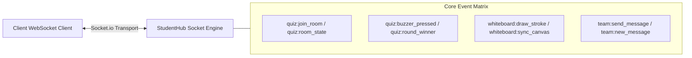

# 05. REST & WebSocket API Documentation

---

## 1. REST API Overview & Conventions

The StudentHub API follows **RESTful conventions** over HTTPS. All requests and responses use JSON payloads (`application/json`), except for file upload endpoints which use `multipart/form-data`.

### Standard Response Envelope

```json
// Successful Response (200 OK / 201 Created)
{
  "success": true,
  "data": { ... },
  "message": "Resource created successfully"
}

// Error Response (400 / 401 / 403 / 404 / 500)
{
  "success": false,
  "message": "Start date cannot be in the past",
  "error": "VALIDATION_ERROR",
  "details": [ ... ]
}
```

### Standard HTTP Status Codes
- `200 OK`: Request succeeded.
- `201 Created`: Resource successfully created.
- `400 Bad Request`: Validation failure or missing parameters.
- `401 Unauthorized`: Missing or invalid JWT bearer token.
- `403 Forbidden`: Authenticated user lacks required role permissions.
- `404 Not Found`: Requested resource does not exist.
- `409 Conflict`: Resource state conflict (e.g., duplicate registration or slot hold collision).
- `500 Internal Server Error`: Unhandled server exception.

---

## 2. Core Endpoint Specifications

### 🔐 Authentication (`/api/auth`)

| Method | Endpoint | Auth | Role | Description |
|:---|:---|:---|:---|:---|
| `POST` | `/api/auth/register` | None | Public | Register new user account with email & password |
| `POST` | `/api/auth/login` | None | Public | Authenticate user and return JWT bearer token |
| `GET` | `/api/auth/me` | JWT | Any | Get current authenticated user's profile |
| `POST` | `/api/auth/forgot-password`| None | Public | Request password reset verification token |
| `POST` | `/api/auth/reset-password` | None | Public | Reset password with token |

#### Example: `POST /api/auth/login`
```json
// Request Payload
{
  "email": "alex.student@campus.edu",
  "password": "Password123!"
}

// Response Payload (200 OK)
{
  "success": true,
  "token": "eyJhbGciOiJIUzI1NiIsInR5cCI6IkpXVCJ9...",
  "user": {
    "_id": "664b1f8a8b1c4e001a4e1234",
    "name": "Alex Mercer",
    "email": "alex.student@campus.edu",
    "role": "student"
  }
}
```

---

### 🎟️ Events & Hackathons (`/api/events`)

| Method | Endpoint | Auth | Role | Description |
|:---|:---|:---|:---|:---|
| `GET` | `/api/events` | Optional | Public | List approved events (filters: `search`, `type`, `status`, `page`) |
| `POST` | `/api/events` | JWT | Student / Host | Submit new event via 4-step wizard (sets `status: pending_approval`) |
| `GET` | `/api/events/:id` | Optional | Public | Get single event details with organizer & agenda info |
| `PUT` | `/api/events/:id` | JWT | Host / Admin | Update event details (triggers re-approval if dates changed) |
| `POST` | `/api/events/:id/register`| JWT | Student | Register / join waitlist for event |
| `DELETE`| `/api/events/:id/register`| JWT | Student | Cancel event registration |
| `PUT` | `/api/events/:id/status` | JWT | Admin | Moderate event (`approved`, `rejected`, `cancelled`) |

#### Example: `POST /api/events`
```json
// Request Payload
{
  "title": "HackCampus 2026: AI for Good",
  "description": "Annual 36-hour collegiate hackathon building generative AI solutions.",
  "eventType": "hackathon",
  "startDate": "2026-09-15T09:00:00.000Z",
  "endDate": "2026-09-16T21:00:00.000Z",
  "startTime": "09:00",
  "endTime": "21:00",
  "isVirtual": false,
  "venue": "Campus Innovation Center, Hall A",
  "hostName": "Google Developer Student Club",
  "registrationLimit": 250,
  "tags": ["ai", "hackathon", "python", "react"]
}

// Response Payload (201 Created)
{
  "success": true,
  "data": {
    "_id": "664b21908b1c4e001a4e5678",
    "title": "HackCampus 2026: AI for Good",
    "status": "pending_approval",
    "lifecycleStatus": "upcoming"
  },
  "message": "Event submitted for administrative review."
}
```

---

### 🤝 Team Hunt & Skill Swap (`/api/teams`, `/api/users/skills`)

| Method | Endpoint | Auth | Role | Description |
|:---|:---|:---|:---|:---|
| `GET` | `/api/teams` | Optional | Public | List open teams seeking members |
| `POST` | `/api/teams` | JWT | Student | Create a new team with required roles and skills |
| `GET` | `/api/teams/:id` | Optional | Public | Get team profile and member list |
| `GET` | `/api/teams/:id/match` | JWT | Student | Compute real-time user-team compatibility score |
| `POST` | `/api/teams/:id/apply` | JWT | Student | Apply to join a team with personal note |
| `PUT` | `/api/teams/:id/applications/:appId` | JWT | Team Lead | Accept or reject membership application |

---

### 📄 Career & ATS AI Suite (`/api/resumes`)

| Method | Endpoint | Auth | Role | Description |
|:---|:---|:---|:---|:---|
| `GET` | `/api/resumes` | JWT | Student | Fetch user's saved resumes and score history |
| `POST` | `/api/resumes/upload` | JWT | Student | Upload and parse resume PDF/DOCX |
| `POST` | `/api/resumes/score-job` | JWT | Student | Score resume against custom job description via Gemini |
| `GET` | `/api/resumes/insights` | JWT | Student | Get career skill gap trends and Gemini next-step recommendations |

#### Example: `POST /api/resumes/score-job`
```json
// Request Payload
{
  "resumeId": "664b23548b1c4e001a4e9999",
  "jobDescription": "Looking for a Frontend Engineer with React, TypeScript, and Tailwind experience..."
}

// Response Payload (200 OK)
{
  "success": true,
  "data": {
    "atsScore": 84,
    "matchedSkills": ["React", "TypeScript", "Tailwind CSS", "Git"],
    "missingSkills": ["Next.js", "Redux", "GraphQL"],
    "keywordMatchPercentage": 78,
    "actionableFeedback": [
      "Quantify your bullet points under Work Experience (e.g., 'Improved page load speed by 35%').",
      "Include keywords: GraphQL, Next.js in your technical summary."
    ]
  }
}
```

---

## 3. WebSocket Real-Time API (Socket.io)

### Namespaces & Events Reference



### Event Specifications

| Direction | Event Name | Payload Structure | Description |
|:---|:---|:---|:---|
| **Client → Server** | `join_quiz_session` | `{ quizId: string, username: string }` | Joins the live tournament socket room. |
| **Server → Client** | `quiz_state_update` | `{ status: "waiting"\|"live"\|"ended", participants: [] }` | Broadcasts current room roster. |
| **Server → Client** | `new_quiz_question` | `{ questionIndex: number, text: string, options: [], timeLimit: number }` | Pushes new question to all players simultaneously. |
| **Client → Server** | `submit_buzzer` | `{ quizId: string, answerIndex: number, timestampMs: number }` | Submits player response with client timestamp. |
| **Server → Client** | `buzzer_result` | `{ winner: string, isCorrect: boolean, leaderboard: [] }` | Broadcasts round winner and updated leaderboard. |
| **Client → Server** | `wb_draw_stroke` | `{ classId: string, stroke: { points: [], color: string, width: number } }` | Transmits whiteboard path to active classroom. |
| **Server → Client** | `wb_receive_stroke`| `{ stroke: Object }` | Replays whiteboard drawing on remote clients. |
