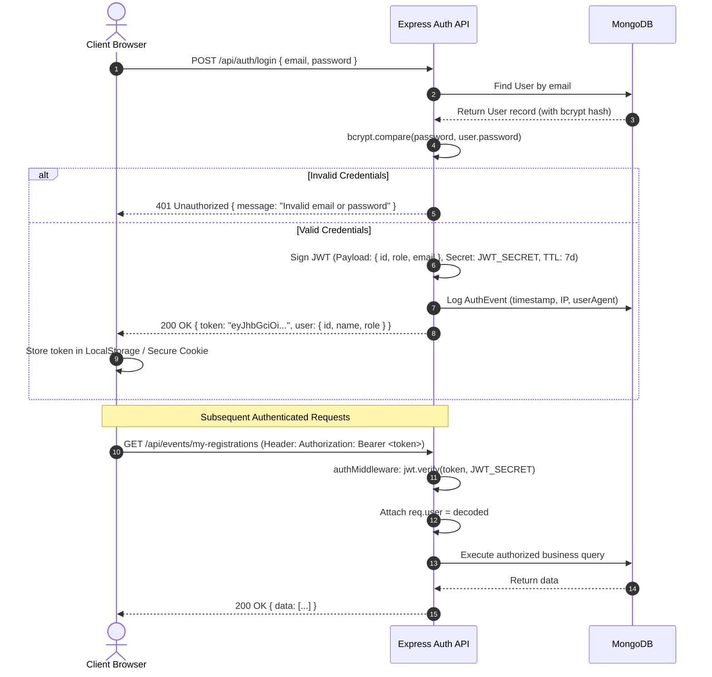
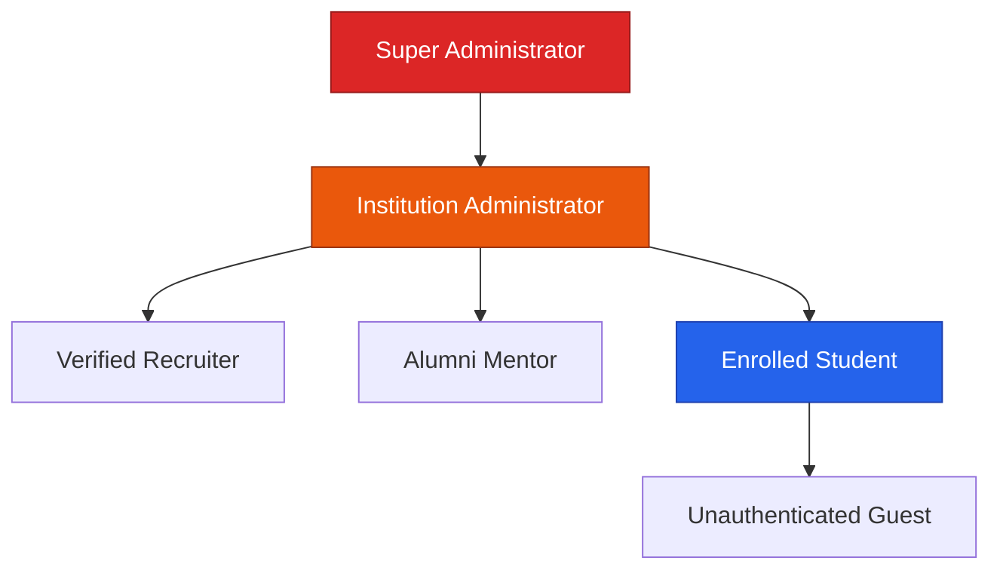
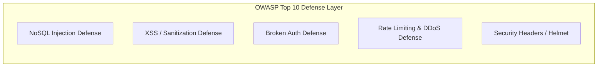

# 06. Authentication Flow, Authorization & Security Architecture

---

## 1. Authentication Lifecycle & Token Architecture

StudentHub implements a **Stateless JWT (JSON Web Token) Authentication** model, engineered for high concurrency, horizontal scalability, and zero session-store lookup overhead.

### Key Security Decisions in Authentication
1. **Bcrypt Hashing**: Passwords are never stored in plaintext. They are salted and hashed using `bcryptjs` with an industry-standard workload factor of **10 salt rounds**.
2. **Stateless Verification**: The `authMiddleware` verifies the cryptographic signature of the token on each request without querying the database, keeping API latency sub-millisecond at the middleware layer.
3. **Audit Logging**: Each successful and failed login attempt logs an `AuthEvent` document to track suspicious brute-force login attempts.

---

## 2. Role-Based Access Control (RBAC)

StudentHub enforces a multi-tier RBAC matrix governing resource access across the platform:

### RBAC Permission Matrix

| Feature / Domain | Guest | Student | Mentor | Recruiter | Institution Admin | Super Admin |
|:---|:---:|:---:|:---:|:---:|:---:|:---:|
| **Browse Events & Hackathons** | ✅ | ✅ | ✅ | ✅ | ✅ | ✅ |
| **Create Campus Event** | ❌ | ✅ | ✅ | ✅ | ✅ | ✅ |
| **Approve / Reject Events** | ❌ | ❌ | ❌ | ❌ | ✅ | ✅ |
| **Create & Join Team Hunt** | ❌ | ✅ | ✅ | ❌ | ✅ | ✅ |
| **Scan Resume with Gemini AI** | ❌ | ✅ | ✅ | ❌ | ✅ | ✅ |
| **Conduct Mock Interviews** | ❌ | ❌ | ✅ | ❌ | ✅ | ✅ |
| **Post Corporate Challenges** | ❌ | ❌ | ❌ | ✅ | ✅ | ✅ |
| **Search Student Talent Bank** | ❌ | ❌ | ❌ | ✅ | ✅ | ✅ |
| **Allocate Scholarships** | ❌ | ❌ | ❌ | ❌ | ✅ | ✅ |
| **System Audit Logs & CMS** | ❌ | ❌ | ❌ | ❌ | ❌ | ✅ |

---

## 3. Comprehensive Security Considerations & OWASP Mitigations

StudentHub is engineered to defend against the **OWASP Top 10** web application security risks:

### 1. Injection Protection (A03:2021)
- **NoSQL Injection**: Express integrates `express-mongo-sanitize` to strip all `$` and `.` operators from incoming `req.body`, `req.query`, and `req.params`.
- **Query Parameter Whitelisting**: Mongoose schemas enforce strict typing. Query filters use explicit field mappings rather than passing raw request objects to `find()`.

### 2. Cross-Site Scripting (XSS) Mitigation (A03:2021)
- **React JSX Auto-Escaping**: React automatically escapes all string expressions rendered in JSX templates.
- **Markdown Sanitization**: When rendering user-submitted rich text (event descriptions, forum posts, notes), content is parsed through strict markdown sanitizers before insertion into the DOM.

### 3. Rate Limiting & Denial of Service (A04:2021)
- **Global Rate Limiter**: Express uses `express-rate-limit` to restrict requests to a maximum of 1,000 requests per 15-minute window per IP.
- **Sensitive Endpoint Limiter**: Auth endpoints (`/api/auth/login`, `/api/auth/register`) and generative AI endpoints (`/api/resumes/score-job`, `/api/ai/*`) enforce strict caps (10 requests per minute) to prevent brute-force attacks and third-party API budget exhaustion.

### 4. HTTP Security Headers (A05:2021)
- The backend configures **Helmet.js** to inject enterprise security headers:
  - `Content-Security-Policy (CSP)`
  - `X-Frame-Options: DENY` (prevents clickjacking)
  - `X-Content-Type-Options: nosniff`
  - `Strict-Transport-Security (HSTS)`
  - `Referrer-Policy: strict-origin-when-cross-origin`

### 5. Race Condition & Concurrency Guard
- Critical multi-user workflows (repair provider slot holds, event ticket limits, team join caps) utilize **MongoDB atomic operators (`$inc`, `$pull`, `$set`)** and unique compound indexes to guarantee that concurrent requests cannot over-allocate resources.
