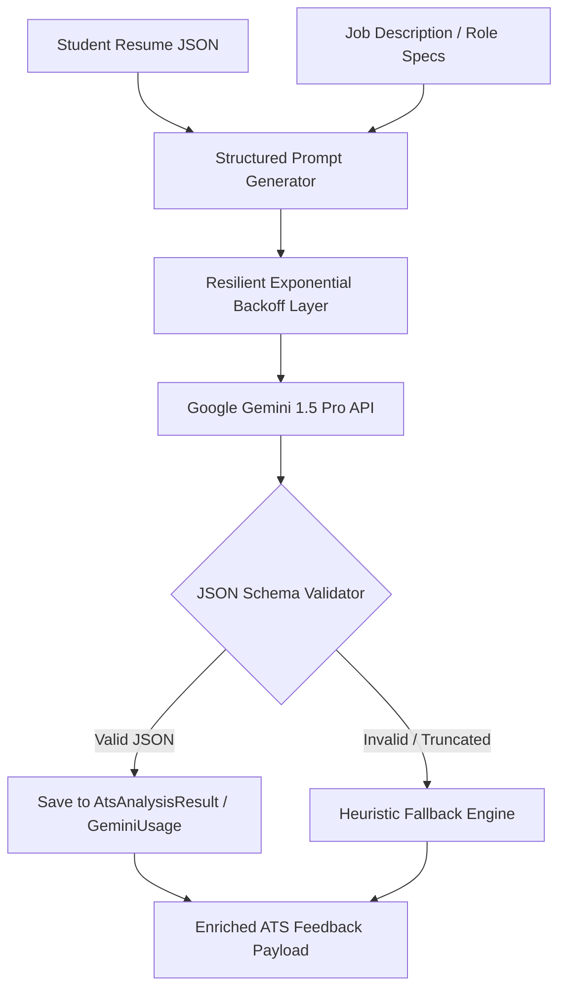
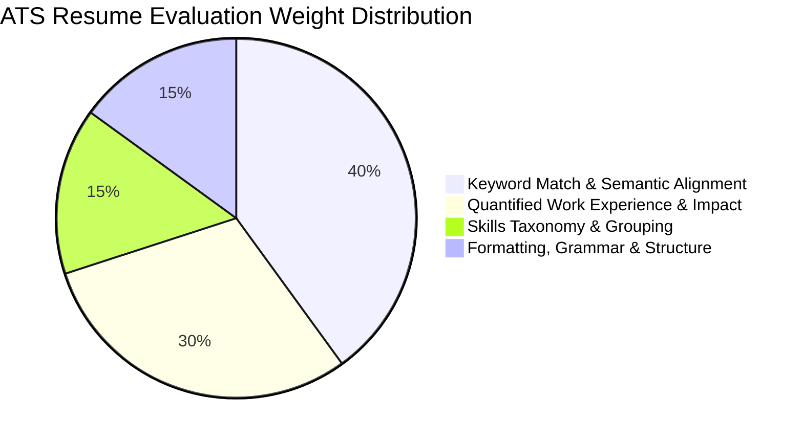

# 07. Machine Learning, AI Pipeline & Heuristic Algorithms

---

## 1. Generative AI Engine (Google Gemini Integration)

StudentHub leverages **Google Gemini 1.5 Pro** via `@google/generative-ai` to power its intelligent career acceleration, resume ATS scoring, personalized skill gap advising, and conversational mock interview agents.



### Resilient AI Invocation Architecture
To guarantee high availability and protect against upstream Gemini 429/500 transient errors, all generative AI calls pass through an **exponential backoff retry wrapper** (`withRetry`):

```javascript
// backend/services/geminiService.js
const withRetry = async (fn, maxRetries = 3) => {
  let attempt = 0;
  while (attempt < maxRetries) {
    try {
      return await fn();
    } catch (error) {
      if (error.status === 429 || error.status >= 500) {
        attempt++;
        if (attempt >= maxRetries) throw error;
        const delay = Math.pow(2, attempt) * 1000 + Math.random() * 500; // Jittered backoff
        await new Promise(resolve => setTimeout(resolve, delay));
      } else {
        throw error;
      }
    }
  }
};
```

---

## 2. ATS Resume Scoring Algorithm

The ATS scoring engine evaluates candidate resumes across **4 distinct weighted dimensions**:



### Algorithmic Mathematical Formulation
The final ATS score $S_{ATS} \in [0, 100]$ is computed as:

$$S_{ATS} = 0.40 \cdot S_{keyword} + 0.30 \cdot S_{impact} + 0.15 \cdot S_{skills} + 0.15 \cdot S_{structure}$$

Where:
- $S_{keyword} = \frac{|K_{resume} \cap K_{job}|}{|K_{job}|} \times 100$: Jaccard overlap ratio between resume keywords and target job requirements.
- $S_{impact} = \frac{\sum_{i=1}^{n} \mathbb{I}(\text{bullet}_i \text{ contains metrics}) }{n} \times 100$: Ratio of experience bullet points containing numerical achievements (percentages, revenue, performance gains).
- $S_{skills}$: Coverage score against canonical industry skill clusters.
- $S_{structure}$: Structural formatting compliance score (presence of required sections, contact info, clear chronologies).

---

## 3. Team Hunt Compatibility Matchmaking Engine

The Team Hunt matchmaking algorithm (`teamMatchService.js`) calculates the compatibility score between a student's profile and an open team's requirements.

```mermaid
flowchart LR
    A[User Skills Set: U] --> Matcher{Set Intersection & Normalization}
    B[Team Required Skills Set: T] --> Matcher
    
    Matcher --> Matched[Matched Skills = U ∩ T]
    Matcher --> Missing[Missing Skills = T \ U]
    
    Matched --> ScoreCalc[Score = |U ∩ T| / |T| * 100]
    Missing --> Advisor[SkillGapAdvisor: Recommend Top 3 Resources]
```

### Exact Match & Fuzzy Normalization
To prevent mismatches due to casing or synonyms (e.g., `react.js` vs `React`), all skills undergo canonical normalization:
1. Stripping special characters and whitespace: `cleanSkill = skill.toLowerCase().trim()`.
2. Aliasing: `nodejs` $\rightarrow$ `node.js`, `ts` $\rightarrow$ `typescript`, `py` $\rightarrow$ `python`.
3. Calculating match score:

$$\text{MatchScore}(U, T) = \min\left(100, \left\lfloor \frac{|U_{\text{clean}} \cap T_{\text{clean}}|}{|T_{\text{clean}}|} \times 100 \right\rfloor \right)$$

---

## 4. Heuristic Review Fraud & Scam Detection Engine

To maintain trust and safety across campus housing and student marketplace reviews, an automated background cron (`ReviewFraudDetectionJob`) inspects user activity:

```mermaid
graph TD
    Review[New Review / Listing Submitted] --> Check1{Account Age < 24 Hours?}
    Check1 -->|Yes| Flag1[Add Fraud Score +35]
    Check1 -->|No| Check2{Repetitive Text Similarity > 85%?}
    
    Check2 -->|Yes| Flag2[Add Fraud Score +40]
    Check2 -->|No| Check3{High Velocity Burst (> 5 reviews/min)?}
    
    Check3 -->|Yes| Flag3[Add Fraud Score +50]
    Check3 -->|No| ScoreCheck{Total Fraud Score >= 50?}
    
    ScoreCheck -->|Yes| AutoHide[Auto-Hide Listing & Notify Admin Queue]
    ScoreCheck -->|No| Approve[Mark as Clean & Publish]
```

### Heuristic Scoring Rules
1. **Burst Velocity Heuristic**: If a single IP or user account posts $> 5$ reviews in $< 60$ seconds, the reviews are auto-quarantined.
2. **Sentiment Polarization**: Repeated 1-star or 5-star submissions with identical 1-sentence phrasing trigger Levenshtein distance checks against existing reviews.
3. **Admin Alerting**: All flagged listings are added to `ReviewFlag` with audit explanations for administrative resolution.

---

## 5. Dataset Documentation

StudentHub maintains several curated, structured internal datasets to power offline-capable services:

| Dataset | Location / Schema | Size / Entries | Purpose |
|:---|:---|:---:|:---|
| **Curated Skill Catalog** | `backend/services/skillGapAdvisor.js` | 30+ Tech Stacks | Provides authoritative external learning URLs (React Docs, NeetCode, MDN, Android Kotlin) for missing skills. |
| **Aptitude Question Bank** | `AptitudeQuestion.js` / Seeds | 500+ Questions | Quantitative, logical, and verbal reasoning problems with calibrated difficulty levels. |
| **DSA Problem Roadmap** | `DSAProblem.js` / Seeds | 150+ Problems | Blind 75 / NeetCode style data structure problems with boilerplate inputs and test cases. |
| **Colleges & Universities** | `seedColleges.js` / `College.js` | 100+ Institutions | Accreditation data, official domains, campus coordinates, and college admin contact mappings. |
