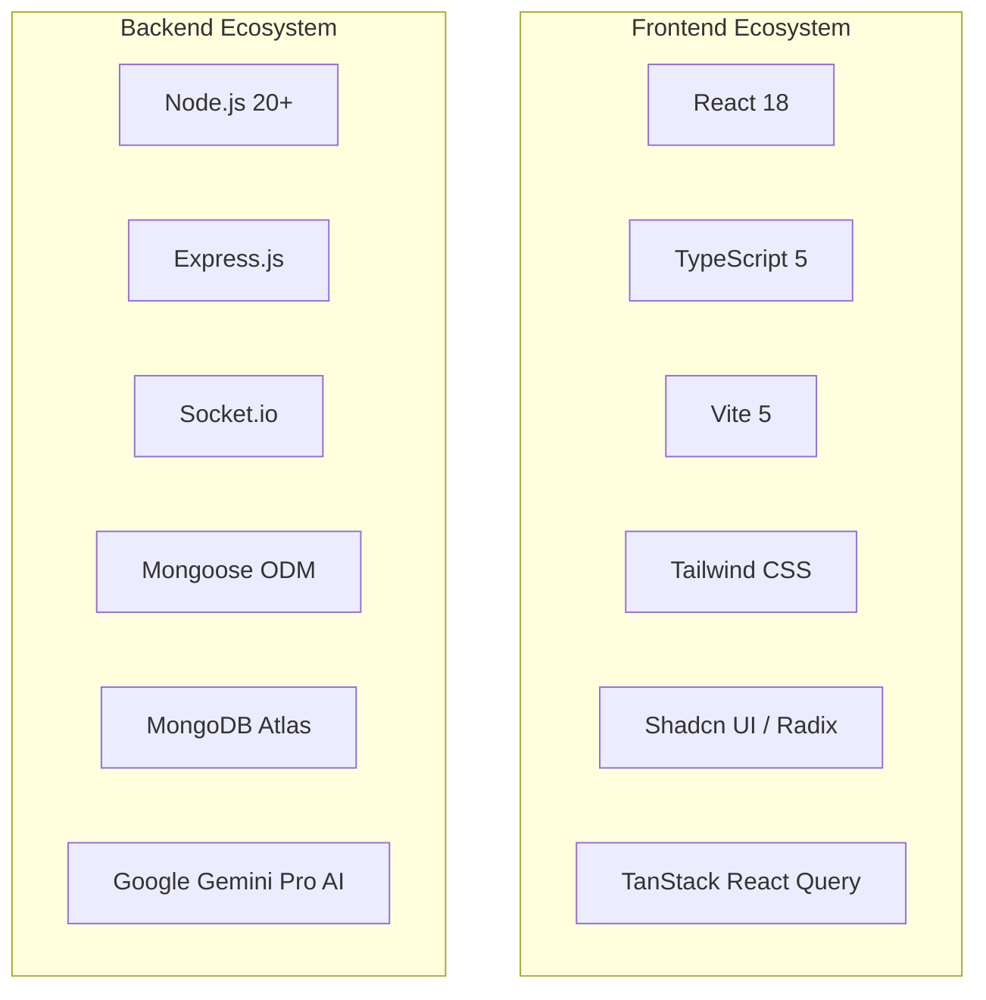

# 08. Technology Stack Justification & Repository Structure

---

## 1. Technology Stack Selection & Architectural Justification

Every library and framework in StudentHub was deliberately chosen based on concrete engineering trade-offs, developer ergonomics, and runtime performance characteristics.



### Architectural Decision Records (ADRs)

#### 1. Frontend: React 18 + Vite vs Next.js SSR
- **Decision**: Adopt **Vite + React 18 SPA** with client-side routing (`react-router-dom`).
- **Justification**:
  - StudentHub is a highly dynamic, authenticated dashboard application where 90% of views require user session state.
  - Server-Side Rendering (SSR) in Next.js introduces significant cold-start latencies and server compute costs for authenticated real-time apps.
  - Vite provides instantaneous Hot Module Replacement (HMR) (< 50ms) and highly optimized ES module build bundling via Rollup.

#### 2. UI Components: Tailwind CSS + Shadcn UI vs Material-UI (MUI)
- **Decision**: Adopt **Tailwind CSS + Shadcn UI (Radix UI primitives)**.
- **Justification**:
  - Shadcn UI copies unstyled accessible primitives directly into the codebase, avoiding bloated runtime CSS-in-JS overhead associated with MUI or Emotion.
  - Tailwind's compiler produces a micro-optimized static CSS bundle (< 30KB gzipped) containing only the utility classes actually used.
  - Full design tokens customization through CSS custom variables (`tokens.css`).

#### 3. Backend: Express.js + Socket.io vs NestJS
- **Decision**: Adopt **Express.js with modular Controller-Service layering + Socket.io**.
- **Justification**:
  - Express is lightweight, battle-tested, and transparent, with zero framework magic.
  - Direct integration with Socket.io allows seamless connection multiplexing over the same HTTP server port.
  - Micro-benchmarks show raw Express handlers have lower memory footprints and faster throughput for high-volume JSON payloads than heavily decorated TypeScript frameworks.

#### 4. Database: MongoDB + Mongoose vs PostgreSQL + Prisma
- **Decision**: Adopt **MongoDB Atlas with Mongoose ODM**.
- **Justification**:
  - Polymorphic collections (260+ models across disparate student domains like events, resumes, housing, quizzes).
  - Deeply nested document structures (e.g., resume work experience, quiz question options, classroom strokes) can be read and written in single atomic operations.
  - Native geospatial indexing (`2dsphere`) for campus housing and repair radius queries without external extensions like PostGIS.

#### 5. Generative AI: Google Gemini Pro vs OpenAI GPT-4o
- **Decision**: Adopt **Google Gemini 1.5 Pro via `@google/generative-ai`**.
- **Justification**:
  - Huge context window capability (up to 1M+ tokens) allows holistic multi-page resume analysis against complete job specifications.
  - Fast inference turnaround times (< 2.5s) for real-time interview conversational flows.
  - Highly competitive API pricing and generous free tier rate limits for educational development.

---

## 2. Complete Repository Directory Structure

```
platform-blueprint/
├── .github/                       # GitHub Actions CI/CD workflows
├── docs/                          # Comprehensive technical documentation suite
│   ├── README.md                  # Documentation master navigation index
│   ├── 01-project-overview.md     # Vision, Problem Statement & Objectives
│   ├── 02-features-and-requirements.md # Features, FRs, NFRs, Stories & Use Cases
│   ├── 03-system-architecture.md  # HLD, LLD, WebSockets & Data Flows
│   ├── 04-database-design.md      # Database Models, ER Diagrams & Indexes
│   ├── 05-api-documentation.md    # REST & WebSocket API Reference
│   ├── 06-auth-and-security.md    # JWT Lifecycle, RBAC & Security Mitigations
│   ├── 07-ai-ml-pipeline.md       # Gemini AI, ATS Scoring & Heuristic Detection
│   ├── 08-tech-stack-and-structure.md # Stack Justifications & Directory Tree
│   ├── 09-setup-and-installation.md # Local Quickstart, Docker & Cloud Deployment
│   ├── 10-testing-and-performance.md # Test Pyramid, Vitest, Cypress & Benchmarks
│   ├── 11-operations-and-troubleshooting.md # Limitations, Roadmap & FAQ
│   ├── 12-demo-and-media.md       # Visual Showcase & Guided Demo Tour
│   └── 13-governance-and-credits.md # Contributing, License & Maintainers
├── backend/                       # Node.js + Express API & WebSocket Server
│   ├── config/                    # Database connection & third-party configs
│   ├── controllers/               # Express request handlers (50+ domain controllers)
│   ├── jobs/                      # Standalone cron tasks (e.g., quiz calibration)
│   ├── middleware/                # Auth guards, role verification, rate limiters
│   ├── models/                    # 260+ Mongoose schemas (User, Event, Team, etc.)
│   ├── routes/                    # Express route definitions (160+ route modules)
│   ├── services/                  # Business logic, AI engine, email & matching services
│   ├── sockets/                   # Socket.io room handlers & real-time listeners
│   ├── tests/                     # Integration tests and concurrency test harnesses
│   ├── utils/                     # Logger, date formatters & helper functions
│   ├── server.js                  # Main server entrypoint, socket setup & crons
│   └── package.json               # Backend dependencies and scripts
├── src/                           # React 18 Frontend Application
│   ├── components/                # Modular reusable UI components
│   │   ├── admin/                 # Admin panel tables & curation tools
│   │   ├── auth/                  # Login, register & password reset modals
│   │   ├── events/                # Event cards, calendar views & filters
│   │   ├── ui/                    # 40+ Shadcn UI primitives (Button, Dialog, etc.)
│   │   └── layout/                # Navbar, Sidebar, Footer & Navigation wrappers
│   ├── hooks/                     # Custom React hooks (useAuth, useSocket, useEvents)
│   ├── lib/                       # Utility helpers, classnames merger (cn)
│   ├── pages/                     # 160+ Application view pages (Events, TeamHunt, ATS)
│   ├── services/                  # Frontend API client & Axios wrappers
│   ├── types/                     # TypeScript interfaces & type definitions
│   ├── App.tsx                    # Top-level routing, query providers & theme layout
│   ├── main.tsx                   # DOM entrypoint
│   ├── index.css                  # Global Tailwind CSS and typography tokens
│   └── tokens.css                 # Color palette & theme variables
├── public/                        # Optimized static assets, logos, and icons
├── cypress/                       # Cypress E2E test suites
├── Dockerfile                     # Multi-stage production container build
├── docker-compose.yml             # Local multi-service orchestration (Web + API + Mongo)
├── tailwind.config.ts             # Tailwind CSS theme extension & design tokens
├── vite.config.ts                 # Vite build & proxy configurations
├── tsconfig.json                  # TypeScript compiler settings
├── package.json                   # Root workspace scripts & dependencies
└── README.md                      # Flagship GitHub landing repository readme
```
