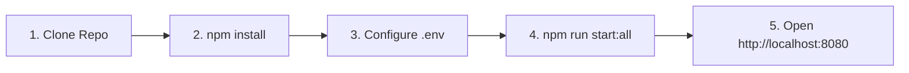
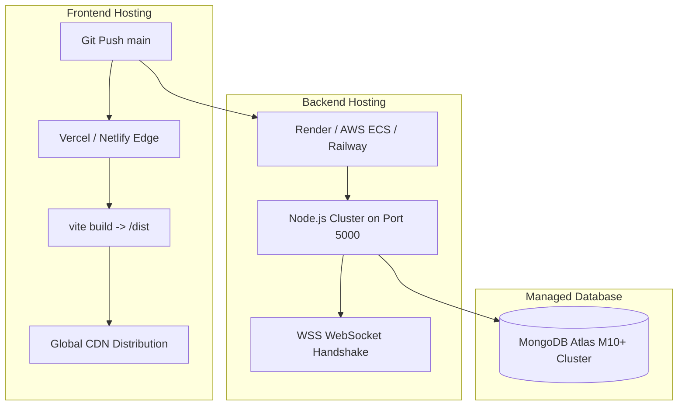

# 09. Setup, Installation, Docker & Deployment Guide

---

## 1. Prerequisites

Ensure your development environment meets the following minimum requirements:

- **Node.js**: `v20.x` or higher (LTS recommended)
- **npm**: `v10.x` or higher (or `pnpm` / `yarn` / `bun`)
- **MongoDB**: `v6.0+` locally installed OR an active [MongoDB Atlas](https://www.mongodb.com/cloud/atlas) cluster URI
- **Google AI Studio API Key**: Required for Gemini Pro AI features ([Get API Key](https://aistudio.google.com/))
- **Docker & Docker Compose** *(Optional, for containerized local execution)*

---

## 2. Environment Variables Configuration

The application requires configuration files in both the `root` and `backend/` directories.

### Backend Configuration (`backend/.env`)

```ini
# Server Configuration
PORT=5000
NODE_ENV=development

# MongoDB Connection
MONGO_URI=mongodb+srv://<username>:<password>@cluster0.mongodb.net/studenthub?retryWrites=true&w=majority

# JWT Authentication
JWT_SECRET=super_secret_jwt_signing_key_at_least_32_characters_long_12345
JWT_EXPIRES_IN=7d

# Google Gemini AI
GEMINI_API_KEY=AIzaSyYourGoogleGeminiApiKeyHere

# Email Notifications (SMTP / Nodemailer)
SMTP_HOST=smtp.gmail.com
SMTP_PORT=587
SMTP_USER=notifications@yourcampus.edu
SMTP_PASS=your_app_password_here

# Client URL (for CORS whitelisting)
CLIENT_URL=http://localhost:8080
```

### Frontend Configuration (`.env`)

```ini
VITE_API_BASE_URL=http://localhost:5000/api
VITE_SOCKET_URL=http://localhost:5000
VITE_APP_NAME="StudentHub"
```

---

## 3. Local Installation & Execution



### Step-by-Step Commands

```bash
# 1. Clone the repository
git clone https://github.com/your-username/platform-blueprint.git
cd platform-blueprint

# 2. Install frontend dependencies
npm install

# 3. Install backend dependencies
cd backend
npm install
cd ..

# 4. Seed initial database data (Colleges, Events, Questions)
cd backend
node seedColleges.js
node seedEvents.js
node seedOA.js
cd ..

# 5. Start both Frontend & Backend concurrently
npm run start:all
```

The frontend will be available at **`http://localhost:8080`** and the backend API at **`http://localhost:5000`**.

---

## 4. Docker & Containerized Setup

StudentHub includes a containerized development and production setup using Docker Compose.

### Running with Docker Compose

```bash
# Build and start all services (Frontend, Express API, MongoDB)
docker-compose up --build -d

# View real-time logs
docker-compose logs -f

# Shut down containers
docker-compose down
```

### `docker-compose.yml` Reference

```yaml
version: '3.8'

services:
  mongodb:
    image: mongo:7.0
    container_name: studenthub-mongo
    restart: always
    ports:
      - "27017:27017"
    volumes:
      - mongo_data:/data/db
    environment:
      MONGO_INITDB_DATABASE: studenthub

  backend:
    build:
      context: ./backend
      dockerfile: Dockerfile
    container_name: studenthub-api
    restart: always
    ports:
      - "5000:5000"
    environment:
      - PORT=5000
      - MONGO_URI=mongodb://mongodb:27017/studenthub
      - JWT_SECRET=docker_local_development_secret_key_12345
      - GEMINI_API_KEY=${GEMINI_API_KEY}
      - CLIENT_URL=http://localhost:8080
    depends_on:
      - mongodb

  frontend:
    build:
      context: .
      dockerfile: Dockerfile
    container_name: studenthub-web
    restart: always
    ports:
      - "8080:80"
    depends_on:
      - backend

volumes:
  mongo_data:
```

---

## 5. Production Cloud Deployment



### Frontend Deployment (Vercel)
1. Link your GitHub repository to Vercel.
2. Set Build Command: `npm run build`.
3. Set Output Directory: `dist`.
4. Add Environment Variable: `VITE_API_BASE_URL=https://api.yourdomain.com/api`.
5. Deploy.

### Backend Deployment (Render / AWS / Railway)
1. Deploy the `backend/` directory as a Node Web Service.
2. Set Build Command: `npm install`.
3. Set Start Command: `node server.js`.
4. Configure all environment variables from `backend/.env`.
5. Ensure TLS termination is configured for `wss://` WebSockets.
