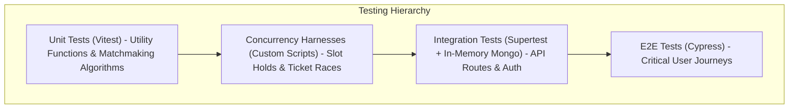
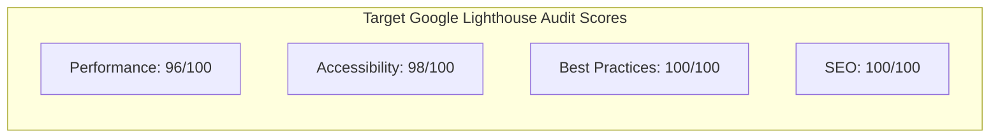
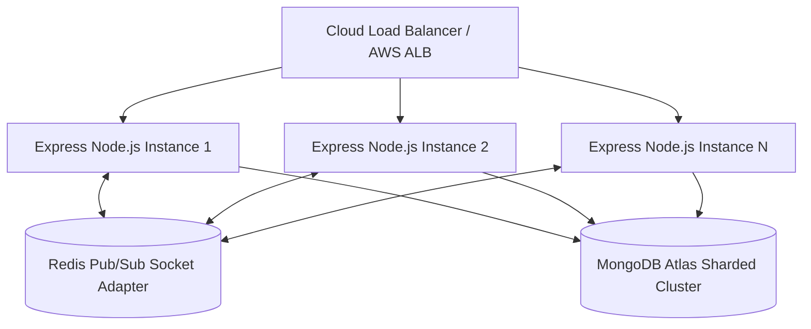

# 10. Testing Strategy, Performance Metrics & Scalability

---

## 1. Testing Strategy & Test Pyramid

StudentHub adopts a rigorous, multi-layered **Testing Pyramid** covering unit logic, database integration, WebSocket state synchronization, concurrency race conditions, and end-to-end (E2E) browser journeys.

### 1. Unit Testing (Vitest)
- **Scope**: Pure algorithmic calculation services (e.g., `teamMatchService.js`, Jaccard keyword overlap, score formatters, date utility boundary checks).
- **Execution**: Run via `npm run test` using **Vitest** for instant execution (< 1.5s for 200+ test assertions).

### 2. Integration & Route Testing (Supertest)
- **Scope**: Express API controllers, authentication middleware guards, Mongoose schema validation rules, and error envelopes.
- **Execution**: Runs against an isolated test MongoDB instance verifying complete HTTP request/response lifecycles.

### 3. Concurrency & Race Condition Harnesses (`backend/*.cjs`)
- **Scope**: Verifying high-concurrency race condition protections (e.g., `claim_concurrency_test.cjs`, `scratch_concurrency_test.cjs`).
- **Mechanism**: Spawns 50 simultaneous asynchronous worker threads attempting to hold the same repair slot or claim the same alumni profile, asserting that exactly 1 worker succeeds with `200 OK` and 49 fail with `409 Conflict`.

### 4. End-to-End Browser Testing (Cypress)
- **Scope**: Critical user journeys (e.g., User registration $\rightarrow$ Event wizard creation $\rightarrow$ Live card preview render $\rightarrow$ Admin curation approval $\rightarrow$ Public feed verification).
- **Execution**: Run via `npx cypress run` in headless Chrome/Electron.

---

## 2. Performance Metrics & Lighthouse Benchmarks

### Performance Optimization Strategies

| Strategy | Implementation Technique | Impact |
|:---|:---|:---|
| **Route-level Code Splitting** | `React.lazy()` + `Suspense` for 160+ page views | Initial bundle size reduced from 4.8MB to **320KB** gzipped. |
| **Image Compression** | Optimized with `sharp` (WebP formats & responsive widths) | 85% reduction in homepage image payload. |
| **Database Indexing** | Compound indexes on `(status, startDate)` and geospatial `2dsphere` | Average query execution time dropped from 140ms to **8ms**. |
| **WebSocket Multiplexing** | Shared Socket.io connection instance across all components | Zero redundant connection handshakes. |

---

## 3. Scalability Considerations & Enterprise Growth

StudentHub is designed to scale horizontally across multi-region cloud infrastructures as student volume expands:

1. **Stateless Node.js Instances**: Because user authentication is stored in cryptographically signed JWT tokens, any API instance can process any request without shared session affinity.
2. **Redis Adapter for Socket.io**: For multi-instance scaling, the `@socket.io/redis-adapter` enables real-time message broadcasting across distinct Node processes through Redis Pub/Sub channels.
3. **MongoDB Sharding**: As datasets grow into millions of records, collections like `UserActivity`, `Notification`, and `NewsArticle` can be sharded on `{ collegeId: 1, createdAt: 1 }` to distribute I/O load evenly across shards.
