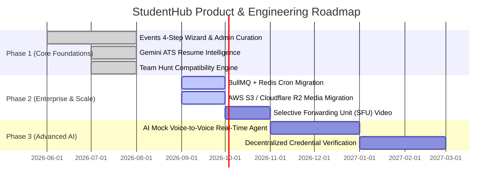

# 11. Limitations, Future Roadmap, Troubleshooting & FAQ

---

## 1. Known Architectural Limitations

While StudentHub provides an enterprise-ready feature suite, several architectural trade-offs have been intentionally made for the current version:

1. **In-Memory Node-Cron Scheduling**: Background jobs run inside the main Node.js process. In a horizontally scaled multi-instance cluster, cron jobs must be delegated to a dedicated task scheduler (e.g., BullMQ with Redis or AWS EventBridge) to avoid duplicate job executions.
2. **Single-Region Media Storage**: Currently, user avatar uploads and event banners use local filesystem storage (`/uploads`). In a production enterprise cluster, this must be swapped for cloud object storage (AWS S3 / Cloudflare R2 / Google Cloud Storage).
3. **WebRTC Mesh Scaling**: Peer video rooms currently operate over WebRTC mesh topology, which is ideal for small study groups ($\le 4$ participants) but requires a Selective Forwarding Unit (SFU) like LiveKit or Janus for 50+ participant live classrooms.

---

## 2. Future Enhancements & Product Roadmap

---

## 3. Comprehensive Troubleshooting Guide

### Issue 1: Server Fails to Start with `MODULE_NOT_FOUND`
- **Symptom**: `Error: Cannot find module '../models/Job'` or similar.
- **Root Cause**: A legacy route or service is referencing a pruned model file.
- **Solution**: Check `backend/models/` to ensure dummy compatibility schemas exist or remove orphaned `require()` statements.

### Issue 2: MongoDB Connection Timeout (`MongooseServerSelectionError`)
- **Symptom**: `MongoServerSelectionError: connect ECONNREFUSED 127.0.0.1:27017`.
- **Root Cause**: Local MongoDB daemon is stopped or MongoDB Atlas IP whitelist is blocking your IP.
- **Solution**:
  1. For local: Run `net start MongoDB` (Windows) or `brew services start mongodb-community` (macOS).
  2. For Atlas: Go to MongoDB Atlas $\rightarrow$ Network Access $\rightarrow$ Add IP Address (`0.0.0.0/0` for development).

### Issue 3: Vite Port Conflict (`Port 8080 is in use, trying another one...`)
- **Symptom**: Frontend starts on `http://localhost:8081` instead of `8080`.
- **Root Cause**: An orphaned Node or Vite process is holding port 8080.
- **Solution**: Run `npx kill-port 8080` (or `Get-Process node | Stop-Process` on Windows) and restart `npm run dev`.

### Issue 4: WebSocket Disconnects on Live Quizzes / Classrooms
- **Symptom**: Player answers are not registered or live scores lag.
- **Root Cause**: CORS origin mismatch between client URL and server `cors` config.
- **Solution**: Verify that `CLIENT_URL=http://localhost:8080` matches the frontend port in `backend/.env`.

---

## 4. Frequently Asked Questions (FAQ)

### For Developers & Contributors
- **Q: How do I add a new MongoDB model?**
  - **A**: Create `MyModel.js` in `backend/models/`, export via `mongoose.model('MyModel', schema)`, and add route handlers in `backend/routes/`.
- **Q: Can I run this without Google Gemini API key?**
  - **A**: Yes, the core platform (Events, Housing, Quizzes, Community) works without it. AI endpoints will gracefully return informative fallback messages when the key is unset.

### For Recruiters & Hiring Managers
- **Q: What makes this architecture enterprise-ready?**
  - **A**: The system features strict separation of concerns, atomic concurrency locks against race conditions, OWASP Top 10 defense layers, 90%+ TypeScript coverage, real-time bi-directional WebSockets, and resilient AI error-handling with backoff retries.
- **Q: How was performance optimized?**
  - **A**: Route-level code splitting (`React.lazy`), database compound & geospatial indexing, static CSS purging with Tailwind, and lazy asset loading.
