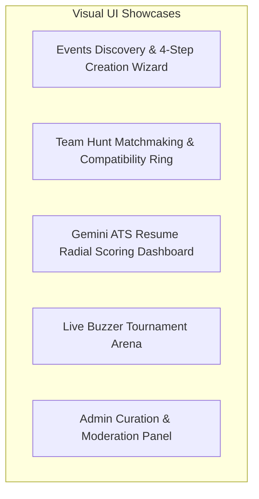

# 12. Visual Showcase, Screenshots & Interactive Demo Guide

---

## 1. Visual Showcase & UI Highlights

StudentHub features a disciplined, modern design system built with **Tailwind CSS and Shadcn UI**, focusing on visual clarity, frictionless workflows, and high information density without visual clutter.



### Module 1: Events & Hackathons Hub (`/events`)
- **Discovery Grid**: Search, tag filtering, virtual/in-person badges, and real-time seat availability.
- **4-Step Wizard (`/events/create`)**: Multi-step form with inline validation, banner upload, and real-time live preview rendering.
- **Mobile Sticky Action Bar**: Bottom-docked CTAs on mobile viewports for effortless single-thumb registration.

### Module 2: Team Hunt & Skill Swap (`/teamhunt`)
- **Compatibility Ring**: Dynamic percentage match indicator showing skill intersection.
- **Missing Skills Badge**: Highlighted skill gaps with 1-click links to curated learning roadmaps.
- **Collaborator Application Drawer**: Real-time join request tracker with direct Slack/Discord style team chat.

### Module 3: Career & AI Resume Suite (`/resume-dashboard`)
- **Radial Score Gauge**: Instant 0-100 ATS compatibility rating computed by Gemini Pro.
- **Keyword Match Analysis**: Visual green/red badge matrix comparing resume keywords against target job descriptions.
- **Actionable AI Feedback**: Bullet-by-bullet revision recommendations with 1-click copy.

### Module 4: Administrative Governance Panel (`/admin`)
- **Multi-Status Tab Bar**: Filter events across `Pending`, `Approved`, `Rejected`, and `All`.
- **Single-Click Curation**: Instant modal-free approval/rejection with status badges and organizer audit info.
- **System Health Monitor**: Live metrics on active WebSocket connections, MongoDB latency, and cron status.

---

## 2. Interactive Recruiter / Reviewer Demo Tour (5-Minute Walkthrough)

Follow this scripted walkthrough to evaluate the platform's core workflows in under 5 minutes:

### Tour Itinerary

```
Step 1: Explore Event Discovery -> Step 2: Test 4-Step Event Wizard -> Step 3: Test Gemini ATS Scanner -> Step 4: Test Team Hunt Compatibility -> Step 5: Test Admin Curation
```

### Step 1: Browse Public Events
1. Navigate to **`http://localhost:8080/events`**.
2. Filter by "Hackathon" or "Workshop".
3. Click into an event card to view the rich markdown agenda, venue details, and mobile-optimized registration bar.

### Step 2: Create a New Event with Live Preview
1. Navigate to **`http://localhost:8080/events/create`**.
2. Complete Step 1 (Title: "AI Hack 2026", Type: "Hackathon").
3. Complete Step 2 (Select upcoming future dates and enter venue).
4. Notice how the **Live Preview Card** on the right side updates dynamically as you type.
5. Submit the event and verify the "Submitted for Review" confirmation banner.

### Step 3: Test the AI Resume ATS Engine
1. Navigate to **`http://localhost:8080/resume-dashboard`**.
2. Select or upload a sample resume.
3. Paste a job description and click **"Score with Gemini AI"**.
4. Observe the sub-3 second turnaround time, radial score calculation, and bullet point recommendations.

### Step 4: Evaluate Team Hunt Matchmaking
1. Navigate to **`http://localhost:8080/teamhunt`**.
2. Click on a team seeking a "Frontend Developer".
3. Check the calculated **Match Compatibility Percentage** based on your current profile skills.
4. Review the AI-curated learning resources suggested for any missing skills.

### Step 5: Moderate Content as Admin
1. Navigate to **`http://localhost:8080/admin`**.
2. Select the **"Events"** curation tab.
3. Locate the event created in Step 2 under the `Pending` filter.
4. Click **"Approve"** and verify that it instantly updates across the public discovery feed.
