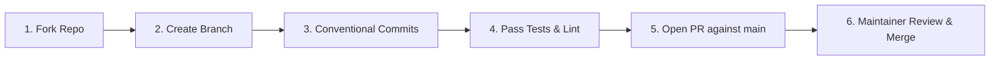

# 13. Governance, Contributing Guide, License & Credits

---

## 1. Contributing Guidelines

We welcome contributions from open-source developers, students, and educators! Follow these standards to submit pull requests:

### Branch Naming Conventions
- `feat/feature-name`: New user-facing features or sub-modules.
- `fix/bug-description`: Bug fixes and error patches.
- `refactor/scope`: Code cleanup without altering behavior.
- `docs/doc-name`: Documentation updates and corrections.
- `test/test-scope`: Adding unit, integration, or Cypress tests.

### Pull Request (PR) Workflow



1. **Fork the Repository**: Clone your fork locally.
2. **Install Dependencies**: Run `npm install` in both root and `backend/`.
3. **Write Clean, Typed Code**:
   - Ensure all new frontend files use strict TypeScript.
   - Adhere to the established Tailwind design tokens in `tokens.css`.
4. **Run Quality Checks**:
   ```bash
   npm run lint          # Verify ESLint rules
   npm run test          # Run Vitest test suite
   ```
5. **Submit PR**: Provide a clear description of the problem solved, testing performed, and screenshots for UI changes.

---

## 2. Code of Conduct

StudentHub is committed to providing a friendly, safe, and welcoming environment for all contributors, regardless of experience level, gender, sexual orientation, disability, ethnicity, or religion.

- **Be Respectful**: Disagree constructively and focus on code quality and user experience.
- **Maintain High Standards**: Write readable, documented, and tested code.
- **Zero Tolerance**: Harassment, offensive comments, or malicious code injections will result in an immediate permanent ban.

---

## 3. License Information

This project is open-source software licensed under the **[MIT License](https://opensource.org/licenses/MIT)**.

```
MIT License

Copyright (c) 2026 StudentHub Engineering Team

Permission is hereby granted, free of charge, to any person obtaining a copy
of this software and associated documentation files (the "Software"), to deal
in the Software without restriction, including without limitation the rights
to use, copy, modify, merge, publish, distribute, sublicense, and/or sell
copies of the Software, and to permit persons to whom the Software is
furnished to do so, subject to the following conditions:

The above copyright notice and this permission notice shall be included in all
copies or substantial portions of the Software.

THE SOFTWARE IS PROVIDED "AS IS", WITHOUT WARRANTY OF ANY KIND, EXPRESS OR
IMPLIED, INCLUDING BUT NOT LIMITED TO THE WARRANTIES OF MERCHANTABILITY,
FITNESS FOR A PARTICULAR PURPOSE AND NONINFRINGEMENT. IN NO EVENT SHALL THE
AUTHORS OR COPYRIGHT HOLDERS BE LIABLE FOR ANY CLAIM, DAMAGES OR OTHER
LIABILITY, WHETHER IN AN ACTION OF CONTRACT, TORT OR OTHERWISE, ARISING FROM,
OUT OF OR IN CONNECTION WITH THE SOFTWARE OR THE USE OR OTHER DEALINGS IN THE
SOFTWARE.
```

---

## 4. References & Academic Citations

1. **Google Gemini API Documentation**: *Generative AI SDK for Node.js*, Google AI for Developers, 2026.
2. **MongoDB Geospatial Indexing**: *Geospatial Queries with 2dsphere Indexes*, MongoDB Manual v7.0.
3. **Socket.io Real-Time Engine**: *WebSocket Multiplexing & Rooms Architecture*, Socket.io Reference Guide.
4. **OWASP Top 10 Web Application Security Risks**: *OWASP Foundation*, 2021/2026 Edition.
5. **Tailwind CSS & Radix UI**: *Accessible Component Primitives*, Tailwind Labs & WorkOS.

---

## 5. Engineering Credits & Maintainers

StudentHub was architected and built by a dedicated team of passionate software engineers and open-source advocates.

| Role | Lead Responsibility |
|:---|:---|
| **Principal Systems Architect** | Distributed architecture, concurrency locks, MongoDB data modeling & real-time Socket.io design |
| **Lead Frontend Engineer** | React 18 component design system, Tailwind tokens, 4-step wizard workflows & responsive mobile sticky actions |
| **AI & ML Pipeline Specialist** | Gemini Pro prompt engineering, ATS scoring algorithms & matchmaking heuristic models |
| **Security & DevOps Lead** | JWT authentication lifecycle, OWASP defenses, Docker multi-container setups & CI/CD deployment pipelines |
